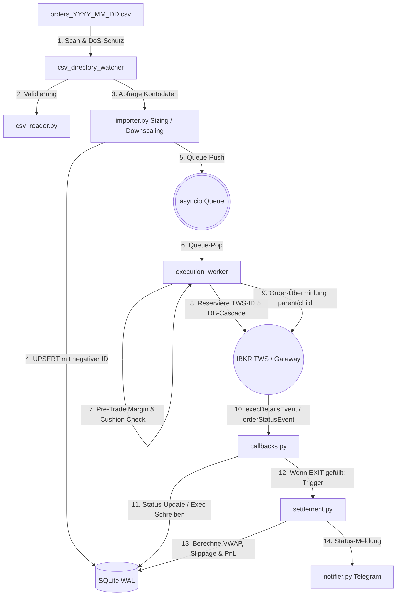

# Systemarchitektur: TradeManager

Dieses Dokument beschreibt die Software-Architektur, Datenflüsse und Abhängigkeiten des **Interactive Brokers Equities Trading System (TradeManager)**. Es dient nachfolgenden Agenten und Entwicklern als schneller Einstieg in die Codebase.

---

## 1. Verzeichnisstruktur (Directory Structure)

Die Codebase ist nach dem Prinzip **Functional Core, Imperative Shell** aufgebaut. Mathematische Berechnungen und Logik sind frei von Seiteneffekten (Functional Core), während Ein-/Ausgabe, Netzwerk und Persistenz in äußeren Schichten gekapselt sind (Imperative Shell).

```text
TradeManager/
├── app/                      # Quellcode der Hauptanwendung
│   ├── core/                 # Systemkonfiguration und Dateninfrastruktur
│   │   ├── config.py         #   Laden von config.toml und .env
│   │   ├── db.py             #   Verbindung im SQLite WAL-Modus, Transaktions- und Migrationssteuerung
│   │   ├── logging_setup.py  #   Strukturiertes JSON-Logging über structlog
│   │   └── models.py         #   Immutable Datenklassen (LegRow, OrderRow, ExecutionRow, SettlementRow)
│   ├── services/             # Hintergrunddienste für Dateimonitoring und Alarmierung
│   │   ├── alert_watcher.py  #   Dead-Order- und Slippage-Monitoring
│   │   ├── csv_reader.py     #   Einlesen und Gruppenvalidierung der CSV-Orderzeilen
│   │   ├── importer.py       #   CSV-Import, Positionsgrößenbestimmung (Sizing), DB-UPSERT
│   │   └── notifier.py       #   Asynchroner Telegram-Client mit Rate-Limiting
│   ├── trading/              # Kern-Ausführungslogik und TWS-Kopplung
│   │   ├── callbacks.py      #   Event-Handler der TWS (Status, Fills, Commissions, Errors)
│   │   ├── error_codes.py    #   TWS-Fehlerklassifikation (INFO, RETRIABLE, FATAL etc.)
│   │   ├── order_builder.py  #   Instanziierung von ib_async Order- und Contract-Objekten
│   │   ├── recovery.py       #   Zustandsabgleich (Startup & periodisch) zwischen DB und TWS
│   │   ├── retry.py          #   Exponentieller Backoff für transiente API-Fehler
│   │   ├── settlement.py     #   PnL-, VWAP- und Slippage-Berechnung
│   │   └── worker.py         #   Execution Worker (Queue-Consumer zur Orderübermittlung)
│   └── main.py               # Haupteinstiegspunkt & Orchestrierung
├── doc/                      # Ausführliche PDF-Konzepte und Benutzerhandbücher
│   └── README.md             #   Umfangreiches Benutzer- und Wartungshandbuch
├── migrations/               # Datenbankmigrationen
│   └── 001_initial.sql       #   SQL-Initialisierungsschema
├── references/               # Systemdokumentation für Agenten
│   └── architecture.md       #   (Dieses Dokument)
├── scripts/                  # Hilfs-, Analyse- und Diagnoseskripte
│   ├── check_tws.py          #   TWS-Verbindungs- und Kontostatus-Check
│   ├── dry_run_today.py      #   Lokaler Dry Run des heutigen Imports (ohne DB-Schreiben / Orderübermittlung)
│   ├── run_dry_run_today.py  #   Dry Run auf einer Kopie der Produktionsdatenbank
│   └── run_simulation.py     #   Lokaler End-to-End Systemsimulationstest mit Mock-TWS
└── tests/                    # Unittests und Systemtests (pytest)
```

---

## 2. Zentrale Einstiegspunkte (Entrypoints)

### 2.1 Hauptanwendung
*   **[`app/main.py`](app/main.py)**: Der Haupteinstiegspunkt startet den [`TradingSystemOrchestrator`](app/main.py#L48). Er führt nacheinander die Konfigurationsanalyse, die DB-Integritätsprüfung (mittels `PRAGMA integrity_check`), die Schema-Migrationen durch und stellt die asynchrone Verbindung via `ib_async` zur TWS/Gateway her. Anschließend werden die asynchronen Hintergrunddienste gestartet und der Signal-Handler für einen Graceful Shutdown registriert.

### 2.2 CLI-Hilfsprogramme (Scripts)
*   **[`scripts/check_tws.py`](scripts/check_tws.py)**: Prüft Konnektivität zur Trader Workstation (TWS) und gibt Kontometriken wie `NetLiquidationValue`, `TotalCashValue` und `AvailableFunds` aus.
*   **[`scripts/dry_run_today.py`](scripts/dry_run_today.py)**: Simuliert das Parsing, die Validierung und die Positionsgrößenberechnung der heutigen CSV-Orderdatei (`data/orders/orders_YYYY_MM_DD.csv`), ohne reale Bestellungen abzusetzen oder Daten zu persistieren.
*   **[`scripts/run_dry_run_today.py`](scripts/run_dry_run_today.py)**: Arbeitet auf einer physischen Kopie der Produktionsdatenbank und simuliert auch Live-Depotabgleiche von Exit-Orders.
*   **[`scripts/run_simulation.py`](scripts/run_simulation.py)**: Führt einen vollständigen lokalen E2E-Integrationstest unter Verwendung eines Mocks der TWS-Schnittstelle durch.

---

## 3. Datenfluss und Systemprozesse

Der Lebenszyklus einer Ordergruppe erstreckt sich über mehrere Phasen von der Erkennung der CSV bis zum finalen PnL-Settlement.



### 3.1 Phase 1: Import & Validierung
1.  Der Hintergrunddienst [`csv_directory_watcher`](app/services/importer.py#L40) scannt `data/orders/` auf Muster `orders_YYYY_MM_DD.csv`.
2.  **Ressourcenschutz**: Überschreitet die Datei die konfigurierte Maximalgröße (`max_csv_size_bytes`, z. B. 5 MB), wird der Import blockiert.
3.  Die Datei wird geparst. Der [`csv_reader`](app/services/csv_reader.py) prüft über [`validate_group`](app/services/csv_reader.py#L19) formale Konsistenzen (Einheitliches Symbol, Konto, Richtungen von ENTRY vs. SL/TP/EXIT, Limitpreis-Pflicht).
4.  Bei Fehlern wird die Datei in `.csv.err` umbenannt und eine Telegram-Fehlermeldung gesendet. Bei Erfolg wird sie in `.csv.bak` archiviert.

### 3.2 Phase 2: Positionsgrößenbestimmung (Sizing) & DB-Persistenz
Der [`importer`](app/services/importer.py) berechnet die endgültige Order-Stückzahl (`quantity`) asynchron vor dem DB-Schreiben:
*   **Modi**:
    *   `total_cash`: Das Zuteilungslimit entspricht dem reinen Barbestand (`TotalCashValue`).
    *   `margin_adjusted_capital`: Limit basiert auf Netto-Liquidationswert, Margin-Multiplikator und Allokationslimit-Prozentsatz, gedeckelt durch die verbleibende Buying Power.
*   **Symmetrisches Downscaling**: Übersteigen die prognostizierten Kosten der Ordergruppe das Limit, wird die Stückzahl aller Legs (ENTRY, SL, TP, EXIT) symmetrisch herunterskaliert, um Absicherungen verhältnisgleich zu halten. Sinkt die Stückzahl auf 0, wird die gesamte Gruppe verworfen.
*   Die berechneten Legs werden mit **temporären negativen IDs** (z. B. `-1`, `-2`) in die `orders`-Tabelle via UPSERT eingepflegt. Fremdschlüssel-Constraints aktualisieren verknüpfte Kind-Orders automatisch (`ON UPDATE CASCADE`), sobald die TWS-API-Order-ID zugewiesen wird.
*   Die `trade_group_id` wird in die `asyncio.Queue` geschoben.

### 3.3 Phase 3: Execution Worker & Orderübermittlung
Der [`execution_worker`](app/trading/worker.py#L32) verarbeitet die Queue:
1.  **Verbindungstest**: Ist die TWS offline, wartet der Worker asynchron.
2.  **Cushion & Pre-Trade Margin Check**:
    *   **Cushion**: Ist das freie Polster `< min_cushion_pct` (z. B. 10 %), bricht die Order abbruch (Status: `Error`).
    *   **What-If Simulation**: Das System sendet die Order mit `whatIf = True` an IBKR. Erhöht die Initial Margin die Gesamtauslastung über `max_margin_usage_pct` (z. B. 80 %), bricht der Vorgang ab. Bei Simulations-Timeout (> 5,0s) gilt **Fail-Closed**: Abbruch und Markierung der Order als `Error`.
3.  **TWS-ID Reservierung**: Der Worker akquiriert das asynchrone [`ORDER_ID_LOCK`](app/trading/worker.py#L29), holt eine freie ID über `getReqId()` von TWS und aktualisiert die temporäre negative ID in der DB, wodurch das DB-Cascade greift.
4.  **Platzierung**: Die ENTRY-Order wird mit `transmit=False` gesendet. Erst nach Absenden aller Child-Orders (SL, TP, EXIT) wird das letzte Leg mit `transmit=True` gesendet, um die Ordergruppe atomar freizugeben.
5.  **Post-Fill Exits**: Bei nachträglichem Import von Exit-Orders für bereits ausgeführte Entries wird über `ib.positions()` ein Live-Depotabgleich durchgeführt, um Überverkäufe zu verhindern.

### 3.4 Phase 4: Event-Handling & Callbacks
Der [`TwsCallbacksManager`](app/trading/callbacks.py) verarbeitet asynchron die TWS-Events:
*   `orderStatusEvent`: Aktualisiert den Status einer Order (`Submitted`, `PreSubmitted`, `Filled`, `Cancelled`, `Error`) in der DB. Bei `Filled` wird das Settlement angestoßen.
*   `execDetailsEvent`: Speichert jede Teilausführung in der Tabelle `executions` zur VWAP-Ermittlung ab.
*   `commissionReportEvent`: Ergänzt die exakte Ausführungsgebühr in der Tabelle `executions`.
*   `errorEvent`: Klassifiziert Fehler über [`error_codes.py`](app/trading/error_codes.py). Transiente Fehler (z. B. Netzwerk, Rate-Limits) triggern einen exponentiellen Backoff ([`retry.py`](app/trading/retry.py)) und die Rücksetzung der Order auf `Created` zwecks Re-queue.

### 3.5 Phase 5: Trade Settlement & PnL-Berechnung
Sobald ein schließendes Exit-Leg (`SL`, `TP`, `EXIT`) den Zustand `Filled` erreicht, berechnet [`settlement.py`](app/trading/settlement.py) das Trade-Ergebnis:
1.  **VWAP (Einstieg/Ausstieg)**: $\sum(\text{Menge}_i \times \text{Preis}_i) / \sum(\text{Menge}_i)$ basierend auf den Einträgen in `executions`.
2.  **Slippage**: Abweichung zwischen dem in der CSV definierten `TargetPrice` und dem realisierten Einstiegs-VWAP.
3.  **Netto-PnL**: Brutto-Ergebnis abzüglich aller in `executions` erfassten Kommissionen.
4.  Die Ergebnisse werden transaktionsgesichert in `trades_settlement` geschrieben und ein detaillierter HTML-Report wird via Telegram verschickt.

### 3.6 Phase 6: Systemüberwachung (Alert-Watcher & Heartbeat)
*   **Alert-Watcher**: Der [`alert_watcher`](app/services/alert_watcher.py#L22) läuft im Hintergrund und meldet hängende Orders (länger als `dead_order_threshold_minutes` ohne Statusänderung) sowie hohe Slippage-Abweichungen per Telegram.
*   **Status-Sync**: Alle 5 Minuten führt der Watcher [`order_status_sync_loop`](app/services/alert_watcher.py#L90) eine Recovery ([`recovery.py`](app/trading/recovery.py)) durch, um Offline-Fills oder stornierte Orders abzugleichen.
*   **Keep-Alive & Gateway-Neustart**: Ein asynchroner Ping (`reqCurrentTimeAsync()`) prüft minütlich die Socket-Verbindung. Zwischen 12:00 und 12:05 Uhr (geplanter IBKR Docker-Gateway-Neustart) wird der Heartbeat pausiert, Alarme werden unterdrückt und der Worker wartet, bis die Verbindung wiederhergestellt ist.

---

## 4. Datenmodell & Zustandswerte

Das System speichert Daten in der SQLite-Datenbank `data/trading.db` mit aktivierten Fremdschlüsseln und WAL (Write-Ahead Logging).

### 4.1 Datenklassen-Modelle
Alle Modelle sind als `@dataclass(frozen=True)` in [`app/core/models.py`](app/core/models.py) definiert:
*   [`LegRow`](app/core/models.py#L37): Bildet die unveränderlichen Zeilen der CSV-Importdatei ab.
*   [`OrderRow`](app/core/models.py#L59): Repräsentiert die Order-Absicht (Intention). Der Zustand wird über funktionale Kopien mittels `dataclasses.replace` fortgeschrieben und in die Tabelle `orders` geschrieben.
*   [`ExecutionRow`](app/core/models.py#L111): Erfasst physische Teilausführungen (Realisierung) der TWS, verknüpft mit `orders.order_id`.
*   [`SettlementRow`](app/core/models.py#L128): Hält die konsolidierten Ergebnisse eines geschlossenen Trades.

### 4.2 Lebenszyklus einer Order (`OrderRow.status`)
```
Created (Import) ──> Submitted (Worker gesendet) ──> PreSubmitted (TWS empfangen) ──> Filled (Ausgeführt)
    │                       │
    └──> Error (Fehlgeschl.) └──> Cancelled (Storniert)
```

---

## 5. Externe Abhängigkeiten

Die Kernkomponenten minimieren externe Frameworks und stützen sich vorrangig auf die Python-Standardbibliothek.

| Abhängigkeit | Mindestversion | Zweck / Einsatzgebiet |
| :--- | :--- | :--- |
| **`ib_async`** | $\ge$ 1.0.0 | Asynchroner Client zur Interactive Brokers TWS API ([`ib_async`](https://github.com/erdewit/ib_async)) |
| **`aiosqlite`** | $\ge$ 0.20.0 | Asynchrone Anbindung der SQLite-Datenbank |
| **`aiohttp`** | $\ge$ 3.9.0 | Asynchroner HTTP-Client für die Anbindung der Telegram-Bot-API |
| **`structlog`** | $\ge$ 24.0.0 | Strukturiertes, maschinenlesbares JSON/Console-Logging |
| **`pytest`** | $\ge$ 8.0.0 | Test-Framework für Unittests |
| **`pytest-asyncio`** | $\ge$ 0.23.0 | Unterstützung asynchroner Testfälle |
| **`pytest-cov`** | $\ge$ 5.0.0 | Testabdeckungsberichte |

---

## 6. Public Code Components Index

This section lists all public classes and functions dynamically parsed from the `app/` directory, satisfying the synchronization checks for the `architecture-sync` skill.

### 6.1 Core Models & Configuration
*   [`AccountConfig`](app/core/config.py#L53)
*   [`AppConfig`](app/core/config.py#L35)
*   [`Config`](app/core/config.py#L74)
*   [`TelegramConfig`](app/core/config.py#L64)
*   [`TwsConfig`](app/core/config.py#L18)
*   [`load_config`](app/core/config.py#L211)
*   [`load_env`](app/core/config.py#L87)
*   [`verify_db_integrity`](app/core/db.py)
*   [`create_database_connection`](app/core/db.py)
*   [`run_migrations`](app/core/db.py)
*   [`get_db`](app/core/db.py)
*   [`transaction`](app/core/db.py)
*   [`decimal_from_db`](app/core/models.py#L25)
*   [`order_row_from_db_row`](app/core/models.py#L86)
*   [`configure_logging`](app/core/logging_setup.py)
*   [`clean_ib_async_warnings_processor`](app/core/logging_setup.py)

### 6.2 Application Services
*   [`AlertState`](app/services/alert_watcher.py)
*   [`check_dead_orders`](app/services/alert_watcher.py)
*   [`check_high_slippage`](app/services/alert_watcher.py)
*   [`load_csv`](app/services/csv_reader.py)
*   [`determine_maximum_capital_allocation`](app/services/importer.py)
*   [`resolve_account_id`](app/services/importer.py)
*   [`calculate_downscaled_quantity`](app/services/importer.py)
*   [`get_next_temp_id`](app/services/importer.py)
*   [`run_csv_import`](app/services/importer.py)
*   [`AsyncTelegramRateLimiter`](app/services/notifier.py)
*   [`TelegramNotifier`](app/services/notifier.py)
*   [`send_message`](app/services/notifier.py)
*   [`send_bracket_order_submitted`](app/services/notifier.py)
*   [`send_order_filled`](app/services/notifier.py)
*   [`send_order_failed`](app/services/notifier.py)
*   [`send_importer_info`](app/services/notifier.py)
*   [`send_margin_utilization_warning`](app/services/notifier.py)
*   [`send_high_margin_usage_warning`](app/services/notifier.py)
*   [`send_margin_limit_exceeded`](app/services/notifier.py)
*   [`send_system_status`](app/services/notifier.py)

### 6.3 Trading Core & Callbacks
*   [`ErrorClass`](app/trading/error_codes.py)
*   [`classify_error_code`](app/trading/error_codes.py)
*   [`build_order`](app/trading/order_builder.py)
*   [`make_stock_contract`](app/trading/order_builder.py)
*   [`fetch_active_orders`](app/trading/recovery.py)
*   [`fetch_completed_orders`](app/trading/recovery.py)
*   [`run_recovery`](app/trading/recovery.py)
*   [`handle_retriable_error`](app/trading/retry.py)
*   [`AccountBalanceMetrics`](app/trading/settlement.py)
*   [`ExecutionTuple`](app/trading/settlement.py)
*   [`SettlementInput`](app/trading/settlement.py)
*   [`SettlementOutput`](app/trading/settlement.py)
*   [`fetch_account_balance_metrics`](app/trading/settlement.py)
*   [`calculate_settlement`](app/trading/settlement.py)
*   [`get_settlement_lock`](app/trading/settlement.py)
*   [`cleanup_settlement_lock`](app/trading/settlement.py)
*   [`trigger_settlement`](app/trading/settlement.py)

### 6.4 Callbacks, Worker & Main
*   [`on_order_status`](app/trading/callbacks.py)
*   [`on_exec_details`](app/trading/callbacks.py)
*   [`on_commission_report`](app/trading/callbacks.py)
*   [`on_error`](app/trading/callbacks.py)
*   [`on_disconnected`](app/trading/callbacks.py)
*   [`run_reconnect_callback`](app/trading/callbacks.py)
*   [`run_recovery_callback`](app/trading/callbacks.py)
*   [`handle_retriable_error_callback`](app/trading/callbacks.py)
*   [`trigger_settlement_callback`](app/trading/callbacks.py)
*   [`is_order_reported`](app/trading/callbacks.py)
*   [`is_group_reported`](app/trading/callbacks.py)
*   [`mark_order_reported`](app/trading/callbacks.py)
*   [`mark_group_reported`](app/trading/callbacks.py)
*   [`register_all`](app/trading/callbacks.py)
*   [`process_trade_group`](app/trading/worker.py)
*   [`connect_to_tws`](app/main.py)
*   [`graceful_shutdown`](app/main.py)
*   [`heartbeat_loop`](app/main.py)
*   [`signal_handler`](app/main.py)
*   [`start_background_tasks`](app/main.py)
*   [`wait`](app/main.py)

