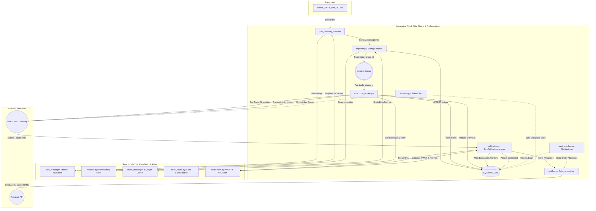

# TradeManager: High-Level System Architecture

This document describes the high-level architecture, dataflow topologies, and invariants of the **Interactive Brokers Equities Trading System (TradeManager)**.

---

## 1. System Context & Overview

TradeManager is an automated equities trading execution and settlement system designed to process daily target portfolios via Interactive Brokers (IBKR). The system functions asynchronously, consuming daily targets from a structured CSV, scaling order sizing dynamically relative to available capital, and executing order groups via IBKR TWS/Gateway while maintaining high-precision local state and real-time alerts.

---

## 2. Architectural Design Patterns & Invariants

The system is constructed around a strict set of architectural rules to ensure deterministic execution, high reliability, and error resilience:

### 2.1 Functional Core / Imperative Shell Split
- **Functional Core (Pure Logic)**: All validation, mathematical calculations (e.g., downscaling trade size, computing PnL, classifying error codes, building orders) are side-effect-free pure functions. They are deterministic, do not access files, databases, network sockets, or time, and are easily testable.
- **Imperative Shell (State & I/O)**: All database writes, API calls, time checks, and directory polling are isolated to the outer boundary. High-level orchestrators load data, delegate decisions to the Functional Core, and persist the results.

### 2.2 Global Constraints & Standards
1. **Python 3.12+ Async Design**: The application runs completely in a single-threaded `asyncio` event loop. All blocking operations (database queries, network calls, file reads) are handled non-blocking.
2. **Decimal Financial Precision**: Every price, quantity, commission, and profit/loss calculation uses Python's standard `Decimal` class instead of binary floats, avoiding floating-point rounding errors.
3. **SQLite WAL Mode**: The local relational database is configured to use Write-Ahead Logging (`PRAGMA journal_mode=WAL`) to allow concurrent reads and prevent writer blocks during active execution periods.
4. **Stateless Execution Layers**: The core execution workers and state recovery loops do not hold in-memory execution state. The single source of truth is the SQLite database, synced continuously with the TWS socket.

---

## 3. Dataflow Topologies

### 3.1 Import, Sizing & Queueing
1. **File Watcher Detection**: A background task polls for `orders_YYYY_MM_DD.csv` in `data/`. If found, a sizing check is initiated.
2. **Capital Zuteilung Limits & Downscaling**: Net liquidation, cash, and buying power are requested from IBKR. The sizing math scales order quantities down symmetrically if estimated costs exceed allocated thresholds.
3. **Database Insertion**: Orders are saved to SQLite with negative temporary parent/child IDs (to maintain bracket structures before TWS ID assignment).
4. **Worker Queueing**: Valid trade groups are pushed to an asynchronous processing queue (`asyncio.Queue`).

### 3.2 Order Execution
1. **Queue Consumer**: An execution worker pops trade groups and evaluates them sequentially.
2. **Cushion & Pre-Trade Simulation**: Checks local account margins. A dry-run `whatIf=True` order is simulated on the IBKR Gateway. If margin usage exceeds `max_margin_usage_pct` or available cushion is below `min_cushion_pct`, the order fails.
3. **ID Assignment**: The worker locks TWS ID allocation, fetches a valid TWS order ID, and replaces the negative temporary IDs in SQLite (relying on `ON UPDATE CASCADE` foreign keys to update child brackets).
4. **Atomic Transmission**: Parent entry orders are transmitted with `transmit=False`. Once all child stop/limit exits are queued in TWS, the final exit order is sent with `transmit=True` to activate the entire bracket.

### 3.3 Callbacks, Settlement & Alerting
1. **Real-time Callbacks**: Fills (`execDetailsEvent`) and status updates (`orderStatusEvent`) write to local tables.
2. **PnL & VWAP Consolidation**: Upon exit fill, the settlement module fetches execution entries, calculates average entry/exit VWAP, commissions, slippage, and net PnL, then persists the record in `trades_settlement`.
3. **Telegram Notification**: Formatted HTML summaries are sent via the rate-limited Telegram client.
4. **Background Alerting**: An independent watchdog scans the database for stuck orders (no status change for over threshold time) or excessive slippage and reports anomalies immediately.

---

## 4. Public Component Reference

This section provides a detailed reference of all public classes and functions in the system, grouped by source module.

### 4.1 Module: `app.core.config`
- `TwsConfig` (Class): Configuration for connection to Interactive Brokers TWS/Gateway.
- `AppConfig` (Class): Application-level settings such as loop intervals and thresholds.
- `AccountConfig` (Class): Account limits, margins, and cushion thresholds.
- `TelegramConfig` (Class): Telegram credentials and target chat settings.
- `Config` (Class): Parent configuration object nesting TWS, App, Account, and Telegram configs.
- `load_env` (Function): Loads environment variables from the given environment path.
- `load_config` (Function): Parses and constructs the type-safe configuration object.

### 4.2 Module: `app.core.db`
- `get_db` (Function): Initializes and returns a SQLite connection in WAL mode.
- `verify_db_integrity` (Function): Runs SQLite integrity checks on the database file.
- `run_migrations` (Function): Executes SQLite schema migrations.
- `transaction` (Function): Async context manager for database transactions.
- `run_db_backup` (Function): Performs database backup using `VACUUM INTO`.

### 4.3 Module: `app.core.logging_setup`
- `clean_ib_async_warnings_processor` (Function): Standardizes warnings from the `ib_async` library.
- `configure_logging` (Function): Sets up structured logger output.

### 4.4 Module: `app.core.models`
- `decimal_from_db` (Function): Safely extracts Decimal values from DB row representation.
- `parse_positive_decimal` (Function): Converts a value to Decimal if it represents a positive number (> 0), else returns None.
- `OrderRow` (Class): Relational structure representing an active IBKR order state.
- `order_row_from_db_row` (Function): Maps a DB mapping row to an `OrderRow` instance.
- `ExecutionRow` (Class): Relational structure representing individual transaction execution fills.
- `SettlementRow` (Class): Relational structure for calculated trade group settlements.

### 4.5 Module: `app.services.alert_watcher`
- `order_status_sync_loop` (Function): Continuous task to synchronize order statuses.
- `check_dead_orders` (Function): Periodically checks for unresponsive orders.
- `check_high_slippage` (Function): Compares actual fills against targets for slippage warnings.
- `AlertState` (Class): Manages reported order and group identifiers to prevent duplicate alerts.
  - `is_order_reported` (Method)
  - `mark_order_reported` (Method)
  - `is_group_reported` (Method)
  - `mark_group_reported` (Method)

### 4.6 Module: `app.services.csv_reader`
- `validate_group` (Function): Asserts bracket consistency and validity of leg rows.
- `load_csv` (Function): Reads and parses input targets into lists of leg rows.

### 4.7 Module: `app.services.importer`
- `AccountBalanceMetrics` (Class): Dataclass encapsulating cash, margin, and liquidation values.
- `run_csv_import` (Function): Orchestrates directory polling and loading of new CSV targets.
- `resolve_account_id` (Function): Queries TWS to determine the default target account ID.
- `calculate_downscaled_quantity` (Function): Computes downscaled order size to respect capital rules.
- `fetch_account_balance_metrics` (Function): Fetches real-time account data from IBKR.
- `determine_maximum_capital_allocation` (Function): Calculates maximum permissible allocation size.
- `get_next_temp_id` (Function): Queries DB to increment temporary execution sequence.

### 4.8 Module: `app.services.notifier`
- `AsyncTelegramRateLimiter` (Class): Implements message throttling for the Telegram API.
  - `wait` (Method)
  - `send_message` (Method)
  - `send_system_status` (Method)
  - `send_order_filled` (Method)
  - `send_order_failed` (Method)
  - `send_loc_execution_anomaly` (Method)
  - `send_importer_info` (Method)
  - `send_bracket_order_submitted` (Method)
  - `send_margin_limit_exceeded` (Method)
  - `send_margin_utilization_warning` (Method)
  - `send_high_margin_usage_warning` (Method)
  - `send_unassigned_position_recovered` (Method)
  - `send_broker_connection_status` (Method)

### 4.9 Module: `app.trading.callbacks`
- `register_all` (Function/Method): Binds TwsCallbacksManager event handlers to TWS.
- `on_order_status` (Function/Method): Callback invoked when order states transition.
- `on_exec_details` (Function/Method): Callback for trade execution details.
- `on_commission_report` (Function/Method): Callback handling trade commission details.
- `on_error` (Function/Method): Dispatches TWS connection/request errors.
- `on_disconnected` (Function/Method): Handles disconnection events from the Gateway.
- `extract_unassigned_execution_details` (Function): Extracts complete contract and execution attributes from unassigned TWS fill objects.
- `handle_unassigned_execution` (Function): Logs detailed warnings for execution events not matching any local order in SQLite.

### 4.10 Module: `app.trading.error_codes`
- `ErrorClass` (Class): Enumeration classifying IBKR error severity.
- `classify_error_code` (Function): Categorizes error codes into actionable retry/fail classes.
- `is_reauthorization_error` (Function): Evaluates whether a TWS error code or message indicates a 2FA/token reauthorization requirement in the Client Portal.
- `is_market_closed_for_symbol` (Function): Checks if regular trading hours have ended for a given symbol (e.g., 17:30 Berlin for Xetra or 16:00 New York for US equities).

### 4.11 Module: `app.trading.order_builder`
- `normalize_symbol` (Function): Normalizes asset symbols by stripping exchange suffixes (e.g., `.DE`).
- `symbols_match` (Function): Robustly verifies whether two symbols match after normalization.
- `make_stock_contract` (Function): Instantiates Stock contract structures for TWS.
- `make_future_contract` (Function): Instantiates Future contract structures for CME (e.g., MNQ, MES).
- `make_contract_for_order` (Function): Dynamically creates either a Stock or Future contract based on OrderRow.
- `get_tick_size` (Function): Returns minimum tick movement of given stock asset.
- `round_to_tick` (Function): Snaps limit prices to valid tick offsets.
- `build_order` (Function): Constructs raw `Order` models with stop/limit brackets or conditional parameters.
- `extract_transmitted_price` (Function): Extracts actual tick-rounded price from a constructed `Order`.

### 4.12 Module: `app.trading.future_resolver`
- `resolve_active_future_contract` (Function): Dynamically resolves the active CME future contract with highest volume.

### 4.13 Module: `app.trading.recovery`
- `run_recovery` (Function): Restores system database matching gateway states.
- `fetch_active_orders` (Function): Requests outstanding execution brackets.
- `fetch_completed_orders` (Function): Fetches finalized bracket details.
- `reconcile_broker_positions` (Function): Reconciles live IBKR positions with local database, auto-recovering unassigned positions into orders and executions tables.

### 4.14 Module: `app.trading.retry`
- `handle_retriable_error` (Function): Processes transitory order errors for rescheduling.

### 4.15 Module: `app.trading.settlement`
- `trigger_settlement` (Function): Evaluates completed execution lists to write final logs.
- `get_settlement_lock` (Function): Obtains execution lock for a trade group.
- `cleanup_settlement_lock` (Function): Releases execution lock for a trade group.
- `ExecutionTuple` (Class): Encapsulates individual execution details.
- `SettlementInput` (Class): Aggregated variables passed to calculations.
- `SettlementOutput` (Class): Summary variables calculated for DB storage.
- `calculate_settlement` (Function): Resolves net price, profit, and commissions.

### 4.16 Module: `app.trading.worker`
- `process_trade_group` (Function): Core worker loop evaluating a single trade group sequence.
- `handle_reauthorization_wait` (Function): Pauses order execution upon a token/reauthorization requirement, performs periodic What-If probes, sends Telegram alerts, and cancels expired orders upon market close.

### 4.17 Module: `app.main`
- `TradingSystemOrchestrator` (Class): Core system loop coordinator and scheduler.
  - `create_database_connection` (Method)
  - `trigger_settlement_callback` (Method)
  - `handle_retriable_error_callback` (Method)
  - `run_recovery_callback` (Method)
  - `run_reconnect_callback` (Method)
  - `start_background_tasks` (Method)
  - `graceful_shutdown` (Method)
  - `heartbeat_loop` (Method)
  - `database_backup_loop` (Method)
- `signal_handler` (Function): Receives OS signals for cleanup.
- `connect_to_tws` (Function): Establishes gateway network socket connection.
