# Nutzerhandbuch: IBKR Equities Trading System (TradeManager)

Willkommen beim offiziellen **Nutzer- und Wartungshandbuch** für das Interactive Brokers Equities Trading System (TradeManager). Dieses Dokument richtet sich sowohl an **Endanwender** (tägliche Benutzung) als auch an **Administratoren und Entwickler** (Wartung, Fehlerbehebung, Erweiterungen).

> **Version:** 1.0 — Stand: Juni 2026  
> **Repository:** `https://github.com/fxhuhn/TradeManager`

---

## Inhaltsverzeichnis

1. [Systemübersicht & Architektur](#1-systemübersicht--architektur)
2. [Installation & Ersteinrichtung](#2-installation--ersteinrichtung)
3. [Konfigurationsreferenz](#3-konfigurationsreferenz)
4. [Täglicher Betrieb (Benutzeranleitung)](#4-täglicher-betrieb-benutzeranleitung)
5. [CSV-Dateiformat & Beispiele](#5-csv-dateiformat--beispiele)
6. [Datenbankschema & Datenmodelle](#6-datenbankschema--datenmodelle)
7. [Detaillierte Systemabläufe (Flows)](#7-detaillierte-systemabläufe-flows)
8. [Positionsgrößenbestimmung & Sizing-Workflow](#8-positionsgrößenbestimmung--sizing-workflow)
9. [Integrierte Hilfsprogramme (Tools)](#9-integrierte-hilfsprogramme-tools)
10. [Docker-Deployment](#10-docker-deployment)
11. [Telegram-Benachrichtigungen](#11-telegram-benachrichtigungen)
12. [Fehlerbehebung (Troubleshooting)](#12-fehlerbehebung-troubleshooting)
13. [Wartung & Betrieb (Operations)](#13-wartung--betrieb-operations)
14. [Tests & Qualitätssicherung](#14-tests--qualitätssicherung)
15. [Glossar](#15-glossar)

---

## 1. Systemübersicht & Architektur

Das System wurde als robuster, hochverfügbarer **End-of-Day (EOD) Trading-Roboter** konzipiert. Es ist für den vollautomatischen Handel von US-Aktien über die Interactive Brokers Trader Workstation (TWS) oder das IB Gateway optimiert.

### 1.1 Architektonische Leitprinzipien

*   **Modernes Python 3.12+:** Konsequente Nutzung von modernem Python-Syntax, statischer Typisierung und asynchroner Ausführung mittels `asyncio` (`ib_async`).
*   **Functional Core, Imperative Shell:** Mathematische Berechnungen und Validierungen (z. B. Positionsgrößenbestimmung, PnL-Berechnung, Validierungen) sind als reine, referenziell transparente Funktionen implementiert (Functional Core). Sämtliche Seiteneffekte wie Datenbankzugriffe (aiosqlite), TWS-API-Interaktionen und Telegram-Notifikationen sind in den äußeren Schichten gekapselt (Imperative Shell).
*   **Standard Library First & Immutability:** Minimierung von Drittanbieter-Bibliotheken (Verzicht auf `pydantic`, stattdessen `@dataclass(frozen=True)` und `TypedDict`). Zustandsänderungen von Kerndatenmodellen wie `OrderRow` erzeugen funktionale Kopien mittels `dataclasses.replace`, wodurch Seiteneffekte und Race-Conditions im asynchronen Betrieb vermieden werden.
*   **Robuste Fehlerkontrolle & Fail-Closed:** Systemkritische Ausfälle (z. B. DB-Korruption) führen zum sofortigen kontrollierten Systemabbruch (Fail-Fast). Risiko- und Margin-Simulationen schlagen bei Timeout oder API-Fehlern fehl (Fail-Closed). Der Trade-Prozess wird abgebrochen und gesperrt, um unkontrollierte Positionsrisiken zu vermeiden.

### 1.2 Projektstruktur

```text
TradeManager/
├── .github/workflows/    # CI/CD Pipelines (Build, Tests, Ruff)
├── app/                  # Quellcode der Hauptanwendung
│   ├── core/             # Konfiguration, Logging, Datenbankverbindung, Datenmodelle
│   │   ├── config.py     #   Laden von config.toml und .env
│   │   ├── db.py         #   SQLite-Verbindung, Migrationen, Integrity-Check
│   │   ├── logging_setup.py # structlog + TimedRotatingFileHandler
│   │   └── models.py     #   Immutable Datenklassen (LegRow, OrderRow, ExecutionRow, SettlementRow)
│   ├── services/         # CSV-Watcher, Alert-Watcher, Telegram-Benachrichtigungen
│   │   ├── alert_watcher.py #   Dead-Order- und Slippage-Monitoring
│   │   ├── csv_reader.py #   CSV-Parsing und Gruppenvalidierung
│   │   ├── importer.py   #   CSV-Import, Sizing, DB-Schreibvorgänge
│   │   └── notifier.py   #   Asynchroner Telegram-Client mit Rate-Limiting
│   ├── trading/          # Order-Generierung, Worker-Schleifen, TWS-Callbacks, Settlement
│   │   ├── callbacks.py  #   Alle TWS Event-Handler (Status, Fill, Commission, Error)
│   │   ├── error_codes.py #  TWS-Fehlercode-Klassifikation
│   │   ├── order_builder.py # Konstruktion von ib_async Order-Objekten
│   │   ├── recovery.py   #   Start-Recovery & Zustandsabgleich
│   │   ├── retry.py      #   Exponentieller Backoff bei transienten API-Fehlern
│   │   ├── settlement.py #   PnL-Berechnung, VWAP, Slippage
│   │   └── worker.py     #   Execution Worker (Queue-Consumer)
│   └── main.py           # Haupteinstiegspunkt & Orchestrierung
├── data/                 # SQLite-Datenbank, Logdateien, CSV-Dateien (lokal ignoriert via .gitignore)
├── doc/                  # PDF-Konzept und dieses Nutzerhandbuch
├── migrations/           # SQL-Datenbankmigrationen
│   └── 001_initial.sql   #   Erstschema (orders, executions, trades_settlement)
├── scripts/              # Hilfs- und Diagnose-Skripte
│   ├── check_tws.py      #   TWS-Verbindungs- und Kapitaltest
│   ├── dry_run_today.py  #   Gefahrenfreier Importsimulator (Live-TWS, kein DB-Schreiben)
│   ├── run_dry_run_today.py # Trockenübung mit Produktions-DB-Kopie
│   └── run_simulation.py #   End-to-End Mock-Systemtest
├── tests/                # Unittests und Systemsimulationen
├── Dockerfile            # Docker-Image-Definition
├── docker-compose.yml    # Docker-Compose (App + Dozzle Logs)
├── config.toml           # Strukturelle Parameter
├── .env / .env.example   # Secrets (Telegram API-Keys)
├── pyproject.toml        # Ruff-Linter- & Formatter-Konfiguration
├── pytest.ini            # Pytest-Konfiguration
└── requirements.txt      # Python-Abhängigkeiten
```

### 1.3 Komponenten-Übersicht

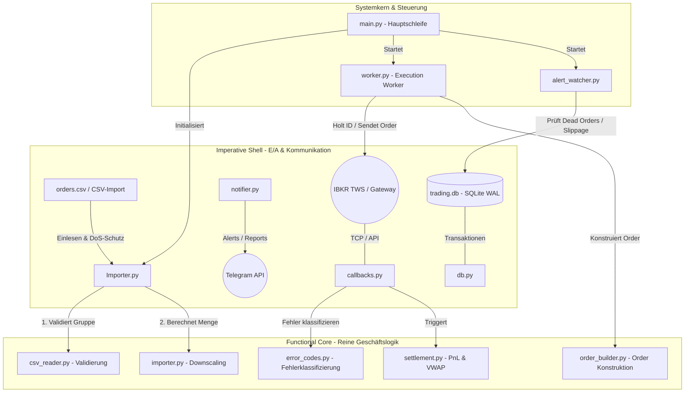

### 1.4 Abhängigkeiten (Requirements)

| Bibliothek     | Version    | Zweck                                   |
|:---------------|:-----------|:----------------------------------------|
| `ib_async`     | ≥ 1.0.0    | Asynchrone TWS-API-Anbindung            |
| `aiosqlite`    | ≥ 0.20.0   | Asynchrone SQLite-Datenbankverbindung    |
| `aiohttp`      | ≥ 3.9.0    | Asynchrone HTTP-Requests (Telegram)     |
| `structlog`    | ≥ 24.0.0   | Strukturiertes Logging                  |
| `pytest`       | ≥ 8.0.0    | Test-Framework (Entwicklung)            |
| `pytest-asyncio` | ≥ 0.23.0 | Async-Test-Support (Entwicklung)        |
| `pytest-cov`   | ≥ 5.0.0    | Code-Coverage-Reports (Entwicklung)     |

---

## 2. Installation & Ersteinrichtung

### 2.1 Voraussetzungen

| Anforderung                   | Details                                                            |
|:------------------------------|:-------------------------------------------------------------------|
| **Python**                    | Version 3.12 oder höher                                            |
| **Betriebssystem**            | macOS, Linux oder Windows (WSL empfohlen)                         |
| **Interactive Brokers TWS**   | Trader Workstation oder IB Gateway muss laufen                    |
| **TWS API-Einstellung**       | *Configuration → API → Settings*: „Enable ActiveX and Socket Clients" aktivieren |
| **TWS Port**                  | Live: `7496`, Paper-Trading: `7497`                               |
| **Telegram Bot** (optional)   | Bot-Token und Chat-ID für Echtzeit-Benachrichtigungen             |

### 2.2 Schritt-für-Schritt-Installation

#### Schritt 1: Repository klonen

```bash
git clone https://github.com/fxhuhn/TradeManager.git
cd TradeManager
```

#### Schritt 2: Virtuelle Umgebung erstellen und aktivieren

```bash
python3 -m venv .venv
source .venv/bin/activate    # macOS / Linux
# oder
.venv\Scripts\activate       # Windows
```

#### Schritt 3: Abhängigkeiten installieren

```bash
pip install --upgrade pip
pip install -r requirements.txt
```

#### Schritt 4: Umgebungsvariablen konfigurieren

Kopieren Sie die Beispieldatei und tragen Sie Ihre Telegram-API-Zugangsdaten ein:

```bash
cp .env.example .env
```

Inhalt der `.env`-Datei:

```ini
# Telegram-Benachrichtigungen
TELEGRAM_BOT_TOKEN=123456789:ABCdefGhIJKlmNoPQRsTUVwxyZ
TELEGRAM_CHAT_ID=-100123456789
```

> **Hinweis:** Ohne gültige Telegram-Konfiguration läuft das System im MOCK-Modus — alle Nachrichten werden nur geloggt, nicht gesendet.

#### Schritt 5: TWS-Verbindung konfigurieren

Öffnen Sie die Datei `config.toml` und passen Sie bei Bedarf die TWS-Verbindungsparameter an:

```toml
[tws]
host = "127.0.0.1"
port = 7496          # 7497 für Paper-Trading
client_id = 0        # 0 für automatisches Binding manueller Orders
```

#### Schritt 6: Datenverzeichnis vorbereiten

```bash
mkdir -p data
```

Das Verzeichnis `data/` wird automatisch erstellt, wenn es nicht vorhanden ist. Hier werden gespeichert:
- `trading.db` — die SQLite-Datenbank
- `app.log` — die rotierende Logdatei
- `orders_YYYY_MM_DD.csv` — die täglichen Order-Dateien

#### Schritt 7: Verbindung testen (optional, empfohlen)

```bash
python scripts/check_tws.py
```

Dieses Skript prüft die Verbindung zur TWS und gibt Kontoinformationen aus (→ [Abschnitt 9.1](#91-check_twspy-konnektivitäts--kapitalschnelltest)).

---

## 3. Konfigurationsreferenz

Das System wird über zwei Dateien konfiguriert: `config.toml` (strukturelle Parameter) und `.env` (Secrets).

### 3.1 `config.toml` — Vollständige Parameterübersicht

#### `[tws]` — TWS-Verbindungseinstellungen

| Parameter                  | Typ     | Standard | Beschreibung                                                         |
|:---------------------------|:--------|:---------|:---------------------------------------------------------------------|
| `host`                     | String  | `"127.0.0.1"` | IP-Adresse der TWS-Instanz                                    |
| `port`                     | Integer | `7496`   | API-Port (7496 = Live, 7497 = Paper)                                |
| `client_id`                | Integer | `0`      | Client-ID (0 = automatisches Binding manueller TWS-Orders)          |
| `connection_timeout_s`     | Float   | `10.0`   | Timeout in Sekunden beim Verbindungsaufbau                          |
| `reconnect_initial_delay_s`| Float   | `5.0`    | Initiale Wartezeit bei Verbindungsabbruch (Basis für Backoff)       |
| `reconnect_max_attempts`   | Integer | `10`     | Maximale Anzahl an Reconnect-Versuchen                              |
| `reconnect_max_delay_s`    | Float   | `120.0`  | Obergrenze des exponentiellen Backoffs bei Reconnects               |
| `request_timeout_s`        | Float   | `10.0`   | Timeout für reguläre TWS-API-Requests                               |
| `completed_orders_timeout_s`| Float  | `15.0`   | Timeout beim Abrufen abgeschlossener Orders                        |
| `heartbeat_interval_s`     | Float   | `60.0`   | Intervall in Sekunden für den Ping-Heartbeat (Keep-Alive)           |
| `heartbeat_timeout_s`      | Float   | `15.0`   | Timeout in Sekunden für die Antwort des Pings (reqCurrentTimeAsync) |

#### `[app]` — Anwendungsparameter

| Parameter                  | Typ     | Standard      | Beschreibung                                                    |
|:---------------------------|:--------|:--------------|:----------------------------------------------------------------|
| `max_retries`              | Integer | `3`           | Maximale Retry-Versuche bei transienten API-Fehlern             |
| `order_rate_limit_s`       | Float   | `0.02`        | Pause zwischen Orders in Sekunden (50 req/s)                    |
| `dead_order_threshold_min` | Integer | `15`          | Minuten, nach denen hängende Orders gemeldet werden             |
| `alert_watcher_interval_s` | Integer | `60`          | Intervall des Alert-Watcher-Loops in Sekunden                   |
| `csv_watcher_interval_s`   | Integer | `60`          | Intervall des CSV-Directory-Watchers in Sekunden                |
| `order_sync_interval_s`    | Integer | `300`         | Intervall des periodischen Order-Zustandsabgleichs (Sekunden)   |
| `retry_backoff_base_s`     | Float   | `5.0`         | Basiswert für exponentiellen Retry-Backoff (5s, 10s, 20s …)    |
| `shutdown_join_timeout_s`  | Float   | `15.0`        | Max. Wartezeit beim Shutdown auf Queue-Leerung                  |
| `database_timeout_s`       | Float   | `30.0`        | SQLite-Verbindungs-Timeout gegen Lockouts                       |
| `max_csv_size_bytes`       | Integer | `5242880`     | Maximale CSV-Dateigröße in Bytes (5 MB, DoS-Schutz)            |
| `log_file_path`            | String  | `"data/app.log"` | Pfad zur zentralen Logdatei                                  |
| `log_rotation_backup_count`| Integer | `5`           | Anzahl rotierender Backup-Logdateien                            |

#### `[account]` — Kontoeinstellungen

| Parameter                  | Typ   | Standard                    | Beschreibung                                                             |
|:---------------------------|:------|:----------------------------|:-------------------------------------------------------------------------|
| `default_limit_pct`        | Float | `0.05`                      | Standard-Kapitalallokation (5% für Slippage-Warnung)                     |
| `margin_multiplier_factor` | Float | `2.0`                       | Faktor zur Bestimmung des Margin-Hebels (für Downscaling)                |
| `sizing_mode`              | String| `"margin_adjusted_capital"` | Sizing-Modus: `'margin_adjusted_capital'` (Standard) oder `'total_cash'` |
| `max_margin_usage_pct`     | Float | `0.80`                      | Maximale Margin-Auslastung (80%) bezogen auf den Netto-Liquidationswert  |
| `min_cushion_pct`          | Float | `0.10`                      | Mindest-Cushion des Kontos (10%), unter dem keine Orders platziert werden |


#### `[strategy_limits]` — Strategie-spezifische Limits

Überschreibt `default_limit_pct` für bestimmte Strategie-Namen aus der CSV:

```toml
[strategy_limits]
Momentum = 0.10        # 10% Allokation
MeanReversion = 0.05   # 5% Allokation
```

#### `[telegram]` — Telegram-Einstellungen

| Parameter           | Typ   | Standard | Beschreibung                                           |
|:--------------------|:------|:---------|:-------------------------------------------------------|
| `rate_limit_delay_s`| Float | `1.5`    | Mindestabstand zwischen Telegram-Nachrichten (Sekunden) |
| `request_timeout_s` | Float | `10.0`   | HTTP-Timeout für Telegram-API-Calls                    |

### 3.2 `.env` — Secrets

| Variable             | Beschreibung                        | Beispiel                            |
|:---------------------|:------------------------------------|:------------------------------------|
| `TELEGRAM_BOT_TOKEN` | Telegram-Bot-Token (von @BotFather) | `123456789:ABCdefGhIJKlmNoPQRsTUVwxyZ` |
| `TELEGRAM_CHAT_ID`   | Ziel-Chat/Gruppen-ID               | `-100123456789`                     |

> **Priorität:** Echte Umgebungsvariablen (`export TELEGRAM_BOT_TOKEN=...`) haben Vorrang vor Einträgen in der `.env`-Datei.

---

## 4. Täglicher Betrieb (Benutzeranleitung)

### 4.1 Systemstart

**Voraussetzung:** Die TWS (oder IB Gateway) muss bereits laufen und die API-Verbindung erlauben.

```bash
# Virtuelle Umgebung aktivieren (falls noch nicht geschehen)
source .venv/bin/activate

# System starten
python app/main.py
```

Nach dem Start durchläuft das System automatisch folgende Phasen:

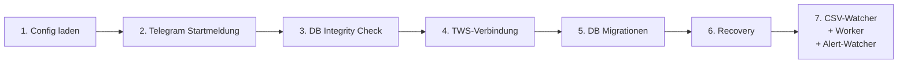

Sie erhalten die Telegram-Nachricht **„🚀 Trading System startet..."** als Bestätigung.

### 4.2 Orders einreichen (CSV-Datei ablegen)

Das System überwacht das Verzeichnis `data/` kontinuierlich auf neue CSV-Dateien.

**So reichen Sie Orders ein:**

1. Erstellen Sie eine CSV-Datei mit dem exakten Namensformat:
   ```
   orders_YYYY_MM_DD.csv
   ```
   Beispiel: `orders_2026_06_04.csv`

2. Legen Sie die Datei im Verzeichnis `data/` ab.

3. Der **CSV-Directory-Watcher** erkennt die Datei automatisch innerhalb von 60 Sekunden (konfigurierbar via `csv_watcher_interval_s`).

4. Nach erfolgreicher Verarbeitung wird die Datei umbenannt in:
   - `orders_2026_06_04.csv.bak` (bei Erfolg)
   - `orders_2026_06_04.csv.err` (bei Fehler)

**Telegram-Bestätigung bei Erfolg:**
> ✅ DATEI IMPORTIERT: Die Datei `orders_2026_06_04.csv` wurde erfolgreich eingelesen und nach `.bak` archiviert.

### 4.3 System beenden (Graceful Shutdown)

Beenden Sie das System geordnet mit:

```bash
# Option A: Ctrl+C im Terminal
Ctrl+C

# Option B: SIGTERM-Signal senden
kill -SIGTERM <PID>
```

Das System fährt kontrolliert herunter:
1. Alle Hintergrunddienste werden abgebrochen
2. Die Queue wird geleert (mit Timeout)
3. Die TWS-Verbindung wird sauber getrennt
4. Sie erhalten die Telegram-Nachricht **„🛑 Trading System geordnet heruntergefahren."**

### 4.4 Tagesablauf-Checkliste

| Schritt | Zeitpunkt                | Aktion                                                         |
|:--------|:-------------------------|:---------------------------------------------------------------|
| 1       | Vor Börseneröffnung      | TWS starten und API-Verbindung prüfen                         |
| 2       | Vor Börseneröffnung      | `python scripts/check_tws.py` — Verbindung & Kapital prüfen   |
| 3       | Vor Börseneröffnung      | TradeManager starten: `python app/main.py`                     |
| 4       | Vor Börseneröffnung      | CSV-Datei `orders_YYYY_MM_DD.csv` in `data/` ablegen           |
| 5       | Optional                 | Dry Run ausführen: `python scripts/dry_run_today.py`           |
| 6       | Während Börsenzeiten     | Telegram-Benachrichtigungen überwachen                         |
| 7       | Nach Börsenschluss       | System herunterfahren (Ctrl+C)                                 |
| 8       | Nach Börsenschluss       | Logdatei `data/app.log` prüfen (bei Bedarf)                   |

---

## 5. CSV-Dateiformat & Beispiele

### 5.1 Spaltenreferenz

Die CSV-Datei muss folgende Spalten enthalten (Reihenfolge beliebig, Kopfzeile erforderlich):

| Spalte           | Typ      | Pflicht | Beschreibung                                                       |
|:-----------------|:---------|:--------|:-------------------------------------------------------------------|
| `trade_group_id` | Text     | ✅       | Eindeutige Gruppen-ID (verknüpft ENTRY mit SL/TP/EXIT)            |
| `bracket_role`   | Text     | ✅       | Rolle: `ENTRY`, `SL`, `TP`, `EXIT`                                |
| `symbol`         | Text     | ✅       | Aktien-Tickersymbol (z. B. `TSLA`, `NVDA`)                        |
| `sec_type`       | Text     | ✅       | Wertpapiertyp (nur `STK` erlaubt)                                 |
| `exchange`       | Text     | ✅       | Börse (nur `SMART` erlaubt)                                       |
| `account_id`     | Text     | ✅       | IBKR-Konto-ID (z. B. `U19605236`)                                 |
| `action`         | Text     | ✅       | Handelsrichtung: `BUY` oder `SELL`                                 |
| `quantity`       | Ganzzahl | ✅       | Stückzahl (muss > 0 sein)                                         |
| `order_type`     | Text     | ✅       | Order-Typ: `LMT`, `STP`, `MKT`, `MOC`                             |
| `target_price`   | Dezimal  | Bedingt | Zielpreis (Pflicht bei `LMT` und `STP`, leer/0 bei `MKT`/`MOC`)  |
| `tif`            | Text     | Optional | Time-in-Force: `DAY`, `GTC`, `OPG` (Standard: `GTC`)             |
| `strategy_name`  | Text     | Optional | Strategie-Bezeichnung (z. B. `TurnoverTiming_0.5`)                |

### 5.2 Validierungsregeln

Eine Trade-Gruppe wird beim Import auf folgende Konsistenzregeln geprüft:

1. **Maximal eine ENTRY-Order** pro `trade_group_id`
2. **Ohne ENTRY** muss mindestens eine Exit-Order (SL, TP, EXIT) vorhanden sein
3. **Einheitliches Symbol:** Alle Legs einer Gruppe müssen dasselbe `symbol` haben
4. **Einheitliche Account-ID:** Alle Legs einer Gruppe müssen dieselbe `account_id` haben
5. **Nur STK + SMART:** Ausschließlich `sec_type = 'STK'` und `exchange = 'SMART'`
6. **Gültige Aktionen:** Nur `BUY` oder `SELL`
7. **Positive Mengen:** `quantity` muss > 0 sein
8. **Preispflicht:** Bei `LMT` und `STP` muss `target_price > 0` sein
9. **Gegenrichtung:** SL/TP/EXIT-Legs müssen entgegengesetzt zur ENTRY-Aktion sein

### 5.3 Beispiel: Vollständige Bracket-Order (ENTRY + SL + TP)

```csv
trade_group_id,bracket_role,symbol,sec_type,exchange,account_id,action,quantity,order_type,target_price,tif,strategy_name
20260604_Momentum_001,ENTRY,NVDA,STK,SMART,U19605236,BUY,10,LMT,208.50,DAY,Momentum
20260604_Momentum_001,SL,NVDA,STK,SMART,U19605236,SELL,10,STP,195.00,GTC,Momentum
20260604_Momentum_001,TP,NVDA,STK,SMART,U19605236,SELL,10,LMT,225.00,GTC,Momentum
```

### 5.4 Beispiel: Reine Entry-Order (ohne Absicherung)

```csv
trade_group_id,bracket_role,symbol,sec_type,exchange,account_id,action,quantity,order_type,target_price,tif,strategy_name
20260604_TurnoverTiming_001,ENTRY,MU,STK,SMART,U19605236,BUY,2,LMT,938.82,DAY,TurnoverTiming_0.5
```

### 5.5 Beispiel: Reine Exit-Order (Position schließen)

Wenn der ENTRY bereits in der Datenbank existiert, kann eine reine Exit-Order importiert werden:

```csv
trade_group_id,bracket_role,symbol,sec_type,exchange,account_id,action,quantity,order_type,target_price,tif,strategy_name
768_TurnoverTiming_0.5_TSLA,EXIT,TSLA,STK,SMART,U19605236,SELL,4,MKT,0.00,OPG,TurnoverTiming_0.5
```

### 5.6 Beispiel: Market-on-Open-Order (OPG)

```csv
trade_group_id,bracket_role,symbol,sec_type,exchange,account_id,action,quantity,order_type,target_price,tif,strategy_name
20260604_NDXMomentum_010,ENTRY,LITE,STK,SMART,U19605236,BUY,10,MKT,0.00,OPG,NDXMomentum
```

---

## 6. Datenbankschema & Datenmodelle

Das System verwendet eine SQLite-Datenbank (`trading.db`) im **Write-Ahead Logging (WAL)** Modus. Dies ermöglicht hervorragende Parallelität zwischen lesenden Hintergrunddiensten (z. B. Alert-Watcher) und schreibenden Transaktionen.

### 6.1 ER-Diagramm

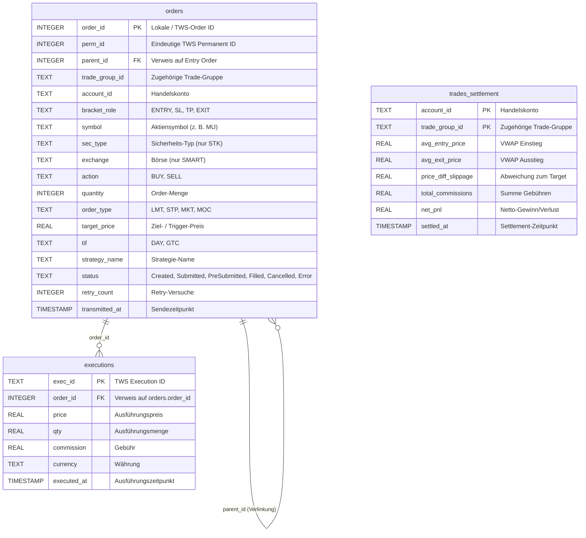

### 6.2 Wichtige Schema-Eigenschaften

1. **Fremdschlüssel-Kaskadierung:** `parent_id` referenziert `orders(order_id) ON UPDATE CASCADE`. Wenn während der Orderübermittlung die temporäre negative ID durch eine echte TWS-API-Order-ID ersetzt wird, aktualisiert die DB automatisch alle verknüpften Child-Orders.
2. **Eindeutigkeit:** Ein Unique Constraint liegt auf `(account_id, trade_group_id, bracket_role)`, was das System unempfindlich gegenüber doppelten Imports macht.
3. **Teilweiser Index:** Ein Unique Index liegt auf `perm_id` (`WHERE perm_id IS NOT NULL AND perm_id != 0`), um Kollisionen zu verhindern und gleichzeitig beliebig viele Orders im Zustand `Created` (mit `perm_id = NULL`) zu erlauben.
4. **Datenintegrität über Immutability:** Die Klasse `OrderRow` ist im Code als unveränderliche `@dataclass(frozen=True)` definiert. Modifikationen während des Order-Lebenszyklus erzeugen neue Instanzen mittels `dataclasses.replace` und werden unmittelbar in der SQLite-Datenbank persistiert.

### 6.3 Order-Status-Lebenszyklus

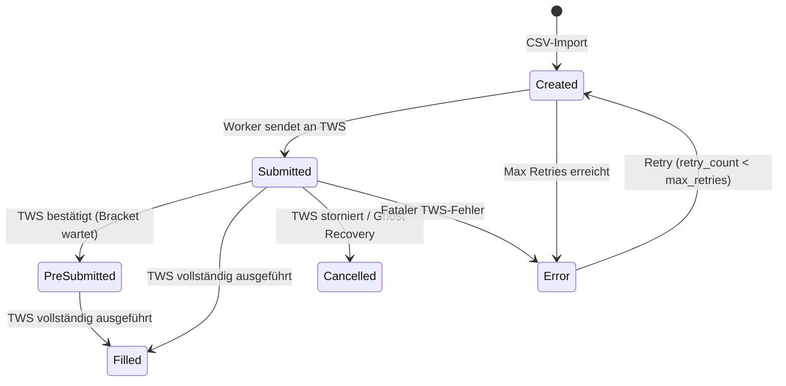

### 6.4 Temporäre negative IDs

Beim Import erhalten neue Orders temporäre **negative IDs** (z. B. `-1`, `-2`, `-3`). Dies verhindert Kollisionen mit echten TWS-Order-IDs (die stets positiv sind). Beim Senden an die TWS wird die negative ID durch die echte TWS-OrderID ersetzt, und die `ON UPDATE CASCADE`-Kaskade aktualisiert automatisch alle verknüpften `parent_id`-Referenzen.

### 6.5 Migrationsmanagement

Migrationen liegen als nummerierte SQL-Dateien im Verzeichnis `migrations/` (z. B. `001_initial.sql`). Beim Start wird die Tabelle `schema_version` geprüft und nur noch nicht angewandte Migrationen werden ausgeführt:

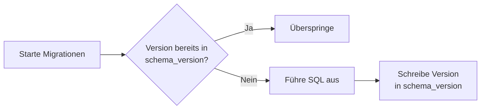

---

## 7. Detaillierte Systemabläufe (Flows)

Das Trading-System durchläuft während seines Lebenszyklus präzise definierte Phasen.

### 7.1 Startup & Initialisierungs-Flow (Phase 1)

Beim Starten der Anwendung (`app/main.py`) wird die Betriebsbereitschaft des Systems schrittweise und ausfallsicher hergestellt.

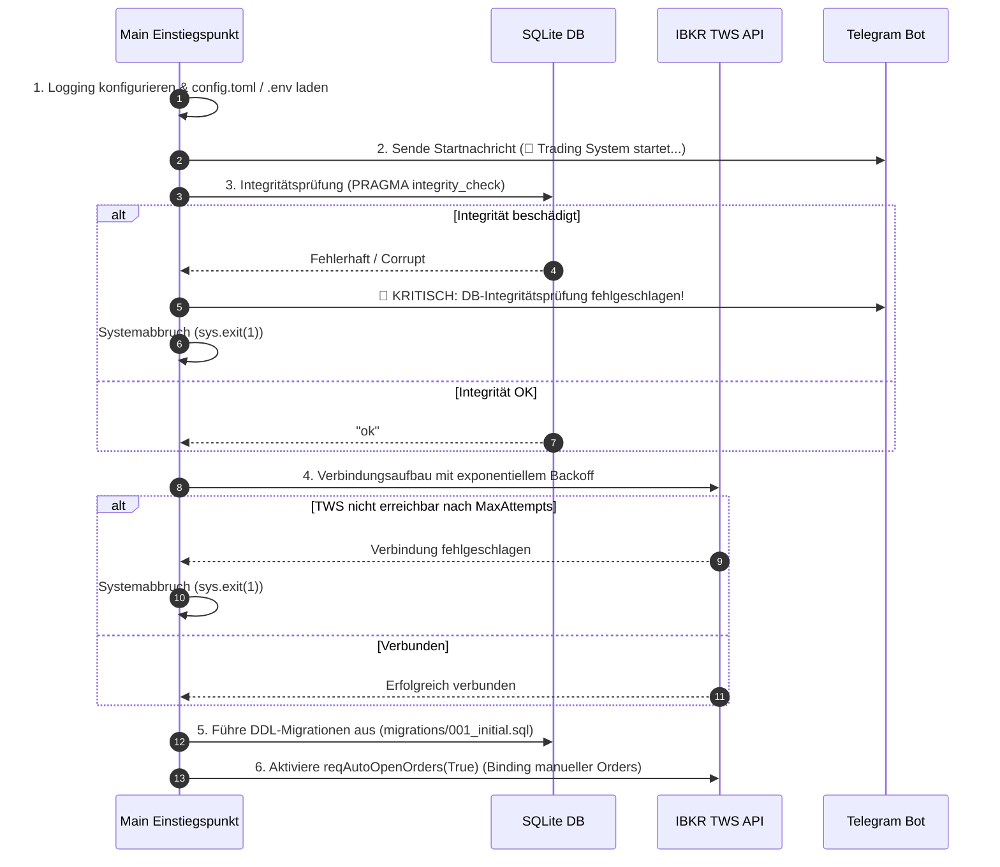

---

### 7.2 Recovery- & Synchronisations-Flow (Phase 2)

Dieser Ablauf gleicht den Zustand der lokalen Datenbank mit dem realen Zustand in der TWS ab, um Abstürze während der Marktzeiten abzufangen.

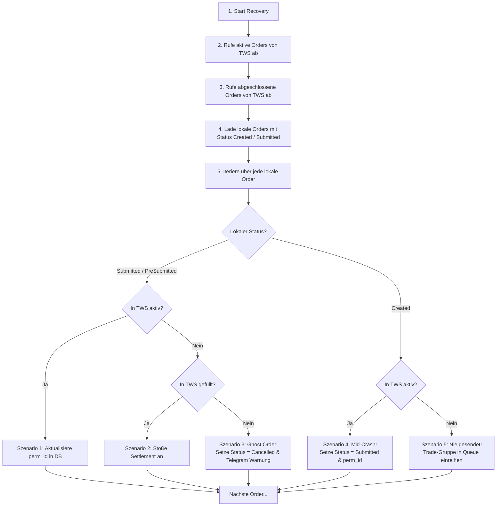

**Recovery-Szenarien im Detail:**

| Szenario | Lokaler Status | TWS-Status | Aktion |
|:---------|:---------------|:-----------|:-------|
| 1 | Submitted | Aktiv | `perm_id` in DB aktualisieren |
| 2 | Submitted | Filled | Settlement auslösen |
| 3 | Submitted | Nicht vorhanden | → `Cancelled` + Telegram-Warnung |
| 4 | Created | Aktiv | → `Submitted` + `perm_id` setzen |
| 5 | Created | Nicht vorhanden | Trade-Gruppe erneut in Queue einreihen |

---

### 7.3 CSV-Import & Sizing-Initiierung (Phase 3)

Der CSV-Import liest die Datei `data/orders_YYYY_MM_DD.csv` ein. Er führt einen DoS-Ressourcenschutz-Check durch und stößt den Sizing-Workflow zur Positionsgrößenbestimmung an.

#### Ablaufschritte:

1. **Dateigrößenprüfung:** Überschreitet die Datei das Limit aus der Konfiguration (`max_csv_size_bytes`, Standard: 5 MB), wird der Import blockiert und ein Telegram-Alarm abgesetzt.
2. **Validierung:** Die Gruppe wird über `validate_group()` auf Konsistenz geprüft (→ [Abschnitt 5.2](#52-validierungsregeln)).
3. **Sizing & Downscaling:** Der Importer fragt die Echtzeit-Kontowerte ab und ruft den Sizing-Workflow auf, um die endgültige Order-Stückzahl zu berechnen (Details siehe [Abschnitt 8: Positionsgrößenbestimmung & Sizing-Workflow](#8-positionsgrößenbestimmung--sizing-workflow)).
4. **Datenbank-Schreiben:** Ein atomarer `BEGIN IMMEDIATE` Block führt einen UPSERT in die Tabelle `orders` durch. Neue Orders erhalten temporär eine **negative ID** (z. B. `-1`, `-2`), um Überschneidungen mit echten TWS-IDs auszuschließen.
5. **Queue:** Die `trade_group_id` wird in die `asyncio.Queue` für den Execution Worker eingereiht.

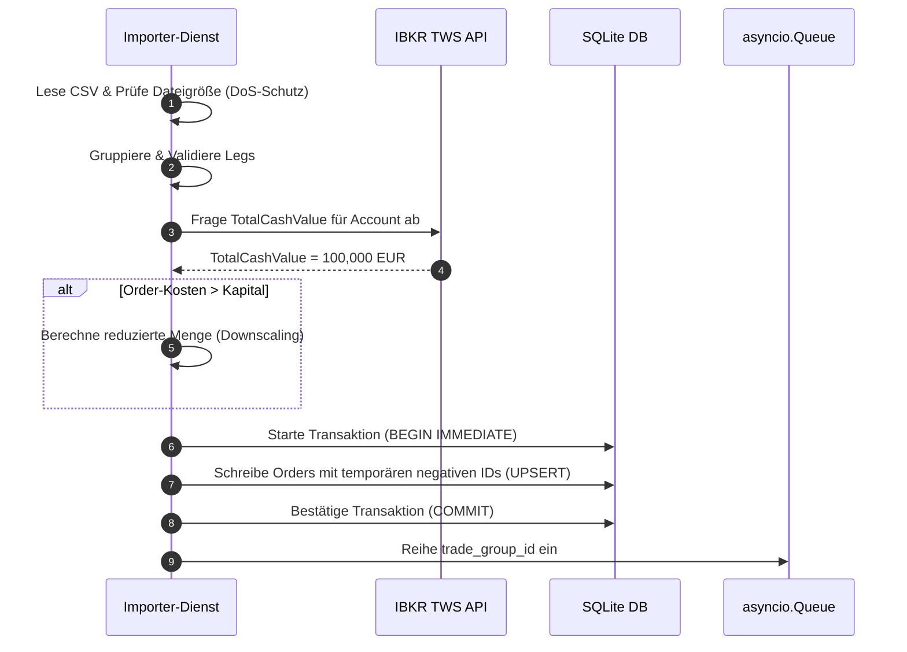

---

### 7.4 Orderübermittlung & TWS-Interaktion (Phase 4)

Der im Hintergrund laufende **Execution Worker** holt sich Trade-Gruppen aus der Queue und sendet die Orders so an die TWS, dass sie als logische Einheit übermittelt werden.

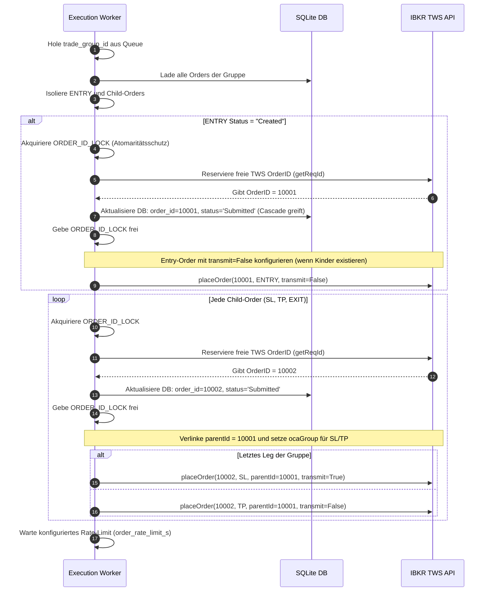

#### Post-Fill Child-Orders (Exit nach bereits gefülltem Entry)

Wenn eine ENTRY-Order bereits den Status `Filled` hat und neue Exit-Orders (SL, TP, EXIT) importiert werden, führt der Worker zusätzlich einen **Live-Depotabgleich** durch:

1. **Depotbestand prüfen:** Über `ib.positions()` wird der aktuelle Bestand des Symbols ermittelt.
2. **Gegenposition vorhanden?** Falls keine offene Position gefunden wird, wird die Exit-Order storniert.
3. **Mengenanpassung:** Wenn der Depotbestand kleiner als die geplante Exit-Menge ist, wird die Menge automatisch auf den verfügbaren Bestand reduziert.
4. **Kein parentId:** Bei Post-Fill Exits wird kein `parentId` gesetzt, da der Entry bereits abgeschlossen ist.

---

### 7.5 Event-Handling & Callback-Flow (Phase 5)

Der `TwsCallbacksManager` reagiert asynchron auf Ereignisse von Interactive Brokers und sorgt dafür, dass der Event-Loop niemals blockiert wird.

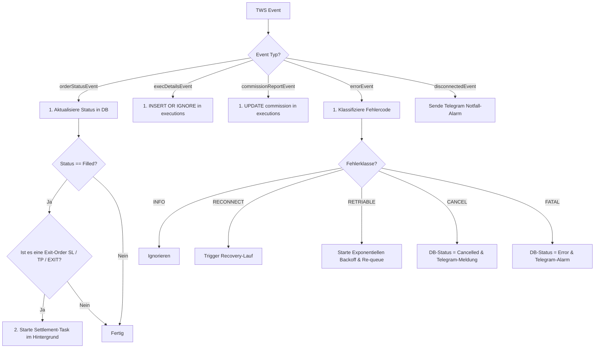

#### TWS-Fehlercode-Klassifikation

| Klasse       | Codes                              | Reaktion                                           |
|:-------------|:-----------------------------------|:---------------------------------------------------|
| `INFO`       | 2104, 2106, 2107, 2108, 2119, 2158, 2100, 2182 | Ignorieren (rein informativ)          |
| `RECONNECT`  | 1101, 1102                         | Recovery-Lauf auslösen                             |
| `RETRIABLE`  | 1100, 1300, 10148, 502, 504, 162   | Exponentieller Backoff + Re-queue                  |
| `CANCEL`     | 202, 10147, 10149, 10268           | Order auf `Cancelled` setzen + Telegram            |
| `FATAL`      | Alle anderen Codes                 | Order auf `Error` setzen + Telegram-Alarm          |

#### Transientes API-Error-Handling (Retry-Logik)

Kommt es zu transienten API-Fehlern (z. B. Netzwerk-Timeout, Rate-Limits), greift die Retry-Logik (`app/trading/retry.py`):

1. **Prüfung:** Liegt der bisherige `retry_count` unter dem Maximum (`max_retries`, Standard: 3)?
2. **Backoff-Berechnung:** Das System wartet einen exponentiellen Delay aus `retry_backoff_base_s × 2^(retry_count - 1)` (z. B. 5s, 10s, 20s). Dies geschieht mittels `asyncio.sleep()`, sodass andere Tasks weiterlaufen.
3. **Status-Reset:** Der DB-Zustand der Order wird auf `Created` zurückgesetzt und die Trade-Gruppe erneut in die Queue eingereiht.
4. **Fehlerschwelle:** Wird das Limit überschritten, wird die Order auf `Error` gesetzt und eine Telegram-Warnung verschickt.

---

### 7.6 Trade Settlement & PnL-Berechnung (Phase 6)

Sobald eine Exit-Order vollständig gefüllt ist (`Filled`), berechnet das System das finanzielle Resultat des gesamten Trades.

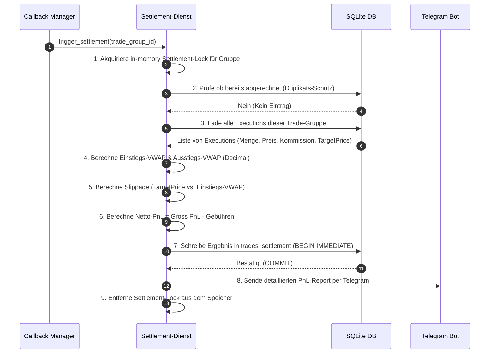

#### Settlement-Berechnungsformeln

| Metrik                   | Formel                                                                        |
|:-------------------------|:------------------------------------------------------------------------------|
| **VWAP (Einstieg/Ausstieg)** | `Σ(Menge_i × Preis_i) / Σ(Menge_i)`                                     |
| **Slippage (BUY)**       | `TargetPrice - VWAP_Entry` (positiv = günstiger als geplant)                 |
| **Slippage (SELL)**      | `VWAP_Entry - TargetPrice` (positiv = günstiger als geplant)                 |
| **Brutto-PnL (BUY)**     | `(VWAP_Exit - VWAP_Entry) × Gesamtmenge`                                    |
| **Brutto-PnL (SELL)**    | `(VWAP_Entry - VWAP_Exit) × Gesamtmenge`                                    |
| **Netto-PnL**            | `Brutto-PnL - Summe(Kommissionen)`                                          |

> **Hinweis:** Alle Berechnungen erfolgen hochpräzise mit `Decimal`-Arithmetik, um Rundungsfehler zu vermeiden.

---

### 7.7 Systemüberwachung & Alert-Watcher (Phase 7)

Der `alert_watcher` läuft kontinuierlich in einem Hintergrund-Loop und führt Sicherheitsprüfungen durch.

| Prüfung              | Intervall | Schwellwert                    | Aktion bei Auslösung                     |
|:----------------------|:----------|:-------------------------------|:-----------------------------------------|
| **Dead Order Check**  | 60 Sek.   | `dead_order_threshold_min` (15 Min.) | Telegram: `⚠️ DEAD ORDER: …`         |
| **High Slippage Check** | 60 Sek. | `default_limit_pct` (5%)       | Telegram: `📉 SLIPPAGE: …`              |
| **Order Status Sync** | 300 Sek.  | —                              | Recovery-Lauf (Zustandsabgleich mit TWS) |

**Redundanz-Schutz:** Der Watcher verfügt über einen In-Memory-Status (`AlertState`), um doppelte Benachrichtigungen für dasselbe Problem zu verhindern.

---

### 7.8 Graceful Shutdown Flow (Phase 8)

Beim Erhalten eines Beendigungssignals (`SIGINT` / `SIGTERM` / `KeyboardInterrupt`) fährt das System absolut verlustfrei herunter.

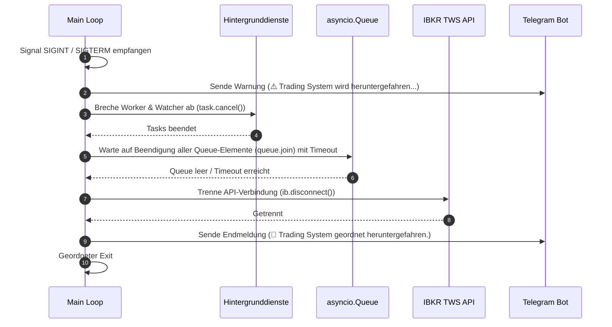

---

### 7.9 Margin-Kontrolle & Risiko-Überwachung (Phase 9)

Vor der Übermittlung jeder neuen `ENTRY`-Order führt das System eine automatisierte, mehrstufige Margin- und Risikoanalyse durch. Damit wird sichergestellt, dass das Handelskonto vor Überhebelung geschützt ist und keine Orders platziert werden, die Liquidationsrisiken bergen.

#### Stufen der Risikoüberprüfung:

1. **Cushion Check (Konto-Cushion):**
   * Das System liest den aktuellen Wert für das Tag `Cushion` (Verhältnis zwischen Netto-Liquidationswert und Margin-Anforderung) aus den Kontodaten der TWS.
   * Fällt dieser Wert unter den in `min_cushion_pct` (z. B. `0.10` für 10%) konfigurierten Schwellenwert, wird die Platzierung blockiert.
   * Die Order wird in der Datenbank auf den Status `Error` gesetzt und eine kritische Telegram-Meldung (`🚨 MARGIN-LIMIT ÜBERSCHRITTEN`) verschickt.

2. **What-If Simulation (Pre-Trade Margin Check):**
   * Das System erstellt eine Simulation der Order mit gesetztem Flag `whatIf = True` und sendet diese an Interactive Brokers.
   * Über das zurückgegebene `whatIfInfo` werden die prognostizierten Werte für die Initial Margin (`initMarginAfter`) und den Netto-Liquidationswert (`equityWithLoanAfter`) ermittelt.
   * Die neue Initial Margin darf die konfigurierte Grenze `equityWithLoanAfter * max_margin_usage_pct` (z. B. 80%) nicht überschreiten.
   * Bei einer Überschreitung wird die Order blockiert, auf `Error` gesetzt und ein Telegram-Alarm ausgelöst.
   * **Fail-Closed Sicherheit:** Um das Konto vor unkontrollierten Risiken zu schützen, führt ein Timeout (Limit: 5,0 Sekunden) oder ein Fehler bei der What-If-Simulation zum sofortigen Abbruch der Orderübermittlung. Die Order wird auf den Status `Error` gesetzt, und es wird eine Telegram-Warnung versendet (Fail-Closed).

3. **Margin-Nutzung Warnung (Cash-Überdeckung):**
   * Der Kaufwert der Order (`Quantity × TargetPrice`) wird mit dem verfügbaren Barbestand (`TotalCashValue`) abgeglichen.
   * Übersteigt der Kaufwert das verfügbare Cash-Guthaben, wird dies im Log vermerkt und eine Telegram-Warnung (`ℹ️ MARGIN-NUTZUNG ERFORDERLICH`) gesendet, um anzuzeigen, dass Fremdkapital (Margin) in Anspruch genommen wird.

4. **Hohe Margin-Auslastung Warnung (>50%):**
   * Es wird der prozentuale Anteil der prognostizierten Initial Margin am Netto-Liquidationswert berechnet.
   * Übersteigt dieser Anteil 50%, wird ein Warnhinweis im Log protokolliert und eine Telegram-Warnung (`⚠️ HOHE MARGIN-AUSLASTUNG (>50%)`) abgesetzt.

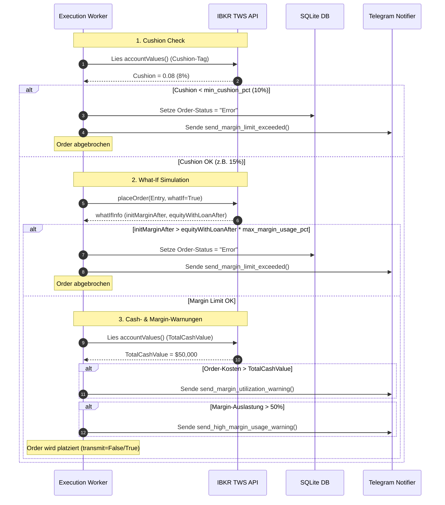

---

### 7.10 Heartbeat Keep-Alive & Gateway-Neustart (Phase 10)

Um die Stabilität der TCP-Verbindung zur Trader Workstation bzw. zum IB Gateway im Dauerbetrieb (24/7) sicherzustellen, verfügt das System über eine aktive Keep-Alive- und Neustart-Steuerung.

#### Keep-Alive Heartbeat:
* **Heartbeat-Schleife:** Ein asynchroner Hintergrunddienst sendet im Intervall `heartbeat_interval_s` (Standard: 60s) eine Zeitabfrage `reqCurrentTimeAsync()` an die TWS.
* **Timeout-Überwachung:** Erfolgt innerhalb von `heartbeat_timeout_s` (Standard: 15s) keine Antwort, gilt die API-Verbindung als blockiert ("stalled").
* **Notfall-Trennung:** Das System sendet einen Telegram-Alarm (`⚠️ HEARTBEAT TIMEOUT | API reagiert nicht`) und ruft `disconnect()` auf. Dies zwingt den Callback-Manager dazu, die automatische Reconnect-Schleife mit exponentiellem Backoff einzuleiten.

#### Behandlung des geplanten Gateway-Neustarts (12:00 Uhr):
Das parallel ausgeführte `extrange/ibkr-docker` Gateway führt täglich um 12:00 Uhr einen automatischen Neustart durch (Konfiguration: `IBC_AutoRestartTime=12:00`). Das System fängt dies wie folgt ab:
1. **Heartbeat-Pause:** Im Zeitraum zwischen 12:00 und 12:05 Uhr pausiert die Heartbeat-Schleife ihre Pings, um Fehlalarme während der geplanten Gateway-Offline-Zeit zu verhindern.
2. **Warnungs-Unterdrückung:** Tritt der Verbindungsabbruch im Zeitraum von 12:00 bis 12:05 Uhr auf, stuft der Callback-Manager dies als geplanten Zustand ein. Es wird kein kritischer Verbindungs-Alarm, sondern eine informative Statusmeldung (`⏳ GEPLANTER NEUSTART`) an Telegram gesendet.
3. **Execution Worker Pause:** Während die API-Verbindung getrennt ist (`isConnected() == False`), pausiert der Execution Worker die Verarbeitung neuer Order-Gruppen in der Queue. Er wartet asynchron in einer Schleife und setzt die Ausführung fort, sobald die Verbindung wieder hergestellt ist.

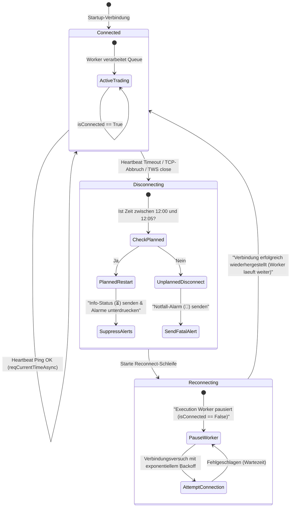


---

## 8. Positionsgrößenbestimmung & Sizing-Workflow

Der Sizing-Workflow berechnet vor der Orderübermittlung die maximal zulässige Handelsgröße (Stückzahl) je Trade-Gruppe auf Basis des Kontokapitals, der Kontoeinstellungen und optionaler Strategie-Limits.

### 8.1 Sizing-Modi

Das System unterstützt zwei Modi zur Ermittlung des maximalen Zuteilungskapitals:

1. **Total Cash (`total_cash`):**
   * Das Limit entspricht dem reinen Echtzeit-Barbestand des Kontos (`TotalCashValue`).
   * Orders werden zu 100 % bar gedeckt (keine Hebelwirkung).

2. **Margin-Adjusted Capital (`margin_adjusted_capital`):**
   * Berechnet das theoretische Handelslimit unter Berücksichtigung des Margin-Hebel-Faktors:
     $$\text{Theoretisches Limit} = \text{NetLiquidationValue} \times \text{margin\_multiplier\_factor} \times \text{allocation\_limit\_percentage}$$
   * Um TWS-Ablehnungen wegen unzureichender Deckung vorzubeugen, wird dieses Limit zusätzlich durch die verbleibende Buying Power gedeckelt:
     $$\text{Buying Power Limit} = \text{AvailableFunds} \times \text{margin\_multiplier\_factor}$$
   * Das finale Zuteilungslimit ist das Minimum beider Werte:
     $$\text{Maximales Zuteilungslimit} = \min(\text{Theoretisches Limit}, \text{Buying Power Limit})$$

*Hinweis: Der `allocation_limit_percentage` entspricht dem in `config.toml` konfigurierten `default_limit_pct` (z. B. 0.05 für 5 %), es sei denn, er wird für den jeweiligen Strategienamen im Bereich `[strategy_limits]` überschrieben.*

### 8.2 Symmetrisches Downscaling-Verfahren

Stellt das System fest, dass die geplanten Kosten einer Order-Gruppe das berechnete Zuteilungslimit überschreiten, wird ein symmetrisches Downscaling angewendet:

1. **Berechnung der neuen Menge:**
   * Basierend auf der ENTRY-Order wird die maximal zulässige Menge über eine ganzzahlige Division ermittelt:
     $$\text{Reduzierte Menge} = \lfloor \text{Maximales Zuteilungslimit} / \text{TargetPrice} \rfloor$$
2. **Symmetrie-Prinzip:**
   * Die reduzierte Menge wird auf **alle Legs** der Trade-Gruppe (ENTRY, Stop-Loss, Take-Profit, EXIT) angewendet. Dadurch bleiben Absicherungen und Gewinnmitnahmen mengenmäßig perfekt synchronisiert.
3. **Mindestmenge:**
   * Sinkt die berechnete Menge auf 0, wird die gesamte Trade-Gruppe übersprungen. Es wird eine Telegram-Benachrichtigung gesendet und ein Log-Eintrag erstellt.

### 8.3 Mathematische Präzision (Decimal Space)

Sämtliche Geldbeträge, Limits, Multiplikatoren und mathematische Divisionen im Sizing-Workflow werden ausnahmslos in **`Decimal`-Arithmetik** (statt Binär-Floats) durchgeführt. Dies garantiert:
* Keine IEEE-754 Rundungsfehler bei Preis- oder Mengenberechnungen.
* Perfekten Abgleich mit den von IBKR gelieferten Kontowerten.

### 8.4 Pre-Trade Risikoanalyse (What-If-Simulation)

Vor der tatsächlichen Übermittlung einer ENTRY-Order an den Markt führt das System eine automatisierte Risikoüberprüfung durch, um das Konto vor Überhebelung oder Margin-Calls zu schützen:

1. **Konto-Cushion Prüfung:**
   * Vor jeder Risiko-Simulation wird der aktuelle Konto-Cushion (freies Margin-Polster) abgefragt.
   * Liegt dieser Wert unter `min_cushion_pct` (z. B. 10 %), wird die Order sofort blockiert (Status `Error`) und nicht an die TWS übermittelt.

2. **What-If Pre-Trade Simulation:**
   * Es wird eine simulierte Order mit dem Flag `whatIf = True` an Interactive Brokers übermittelt. Die TWS führt daraufhin eine hypothetische Margin-Berechnung durch, ohne die Order auszuführen.
   * Das System extrahiert aus der TWS-Simulation:
     * Prognostizierte Initial Margin nach Ausführung (`initMarginAfter`)
     * Prognostizierter Netto-Liquidationswert (`equityWithLoanAfter`)
   * Die Order wird freigegeben, wenn:
     $$\text{initMarginAfter} \le \text{equityWithLoanAfter} \times \text{max\_margin\_usage\_pct}$$
   * Übersteigt die prognostizierte Margin dieses Limit (z. B. 80 %), wird die Order blockiert, als `Error` markiert und per Telegram gemeldet.

3. **Fail-Closed Sicherheit bei Timeout/API-Fehlern:**
   * Die What-If-Simulation wird mit einem strikten Timeout von **5,0 Sekunden** ausgeführt.
   * Sollte die TWS nicht rechtzeitig antworten oder die Simulation fehlschlagen, verhält sich das System **fail-closed**: Die Order wird blockiert, in der DB als `Error` markiert und der Trade abgebrochen. Es erfolgt keine Marktübermittlung auf Basis unvollständiger Risikodaten.

4. **Risiko- und Margin-Warnungen:**
   * **Margin-Nutzung:** Wenn der geplante Kaufwert (`Quantity × TargetPrice`) das verfügbare Cash (`TotalCashValue`) übersteigt, wird eine informative Telegram-Warnung gesendet, dass Fremdkapital (Margin) beansprucht wird.
   * **Hohe Margin-Auslastung:** Beträgt die prognostizierte Margin-Auslastung mehr als 50 %, wird eine Warnmeldung im Log und per Telegram abgesetzt.

---

## 9. Integrierte Hilfsprogramme (Tools)

Zur Absicherung des Live-Betriebs stehen vier Kommandozeilenwerkzeuge bereit:

### 9.1 `check_tws.py` (Konnektivitäts- & Kapitalschnelltest)

Dieses Tool verifiziert die API-Konfiguration und fragt die Kontodaten ab.

**Aufruf:**
```bash
python scripts/check_tws.py
```

**Ablauf:**
1. Lädt die Konfigurationsdaten aus der `config.toml`.
2. Versucht, sich auf den Standardports (`7496` für Live, `7497` für Paper-Trading) mit der TWS zu verbinden.
3. Liest bei erfolgreicher Verbindung alle verfügbaren Konten (`managedAccounts`) sowie die wichtigsten Kapitalmetriken wie **NetLiquidationValue**, **TotalCashValue** und **AvailableFunds** aus und gibt diese tabellarisch aus.

**Beispielausgabe:**
```
==================================================
Testing Interactive Brokers TWS Connection
==================================================
Connecting to TWS at 127.0.0.1:7496 with Client ID 0...

✅ CONNECTION SUCCESSFUL ON PORT 7496!
Managed Accounts: U19605236

--- Available Capital & Account Summary ---
Metric                         |           Value | Currency | Account
---------------------------------------------------------------------------
Net Liquidation Value          |      100,000.00 | EUR      | U19605236
Total Cash Value               |       95,000.00 | EUR      | U19605236
Available Funds                |       85,000.00 | EUR      | U19605236
```

**Einsatzbereich:** Täglicher Pre-Flight-Check vor dem Start des Trading-Systems.

---

### 9.2 `dry_run_today.py` (Gefahrenfreier Importsimulator)

Dieses Skript simuliert den täglichen Order-Import für den aktuellen Handelstag, **ohne reale Orders an die TWS zu senden oder in die Live-Datenbank zu schreiben**.

**Aufruf:**
```bash
python scripts/dry_run_today.py
```

**Ablauf:**
1. Sucht nach der heutigen Auftragsdatei (z. B. `data/orders_2026_06_01.csv`).
2. Verbindet sich mit der TWS über die dedizierte **Client-ID 99**, um die Live-App nicht zu stören.
3. Fragt das Echtzeit-Kapital (`TotalCashValue` & `AvailableFunds`) sowie den aktuellen Kurs für marktrelevante Orders ab.
4. Simuliert die Validierung und das **symmetrische Downscaling** aller Orders.
5. Gibt einen detaillierten tabellarischen Bericht (Dry Run Report) aus, der die geplanten Kosten den angepassten Kosten gegenüberstellt und die Cash-Deckung prüft.

**Einsatzbereich:** Prüfung, ob die heutigen Orders das verfügbare Kapital überschreiten würden und welche Mengenanpassungen vorgenommen werden.

---

### 9.3 `run_dry_run_today.py` (Trockenübung mit Produktions-DB)

Dieses Skript ist eine erweiterte Variante des Dry Runs, die eine **Kopie der Produktionsdatenbank** erstellt und den Import-Prozess mit einer Mock-TWS durchspielt.

**Aufruf:**
```bash
python scripts/run_dry_run_today.py
```

**Ablauf:**
1. Erstellt einen WAL-Checkpoint der Produktions-DB (`PRAGMA wal_checkpoint(TRUNCATE)`)
2. Kopiert `data/trading.db` nach `data/dry_run_trading.db`
3. Führt den CSV-Import auf der Kopie aus
4. Verarbeitet die Trade-Gruppen durch den Execution Worker (mit Mock-TWS)
5. Gibt die Ergebnisse aus und löscht die Testdatenbank anschließend

**Besonderheit:** Simuliert auch den **Live-Depotabgleich** für Exit-Orders (z. B. „Sind 8 TSLA-Aktien im Depot?").

**Einsatzbereich:** Vollständiger Systemtest, bevor reale Orders platziert werden. Ideal für Exit-Orders, deren zugehöriger ENTRY bereits in der Produktions-DB existiert.

---

### 9.4 `run_simulation.py` (End-to-End Mock-Systemtest)

Dieses Skript führt eine **vollständige System-Simulation** mit einer Mock-TWS durch — inklusive Order-Ausführung, Teilfüllungen, Gebühren und Settlement.

**Aufruf:**
```bash
python scripts/run_simulation.py [optionaler_csv_pfad]
```

Ohne Argument wird `data/orders.csv` verwendet.

**Ablauf:**
1. Erstellt eine temporäre Datenbank `data/simulation_trading.db`
2. Initialisiert alle System-Komponenten mit einer Mock-TWS
3. Führt alle 8 Phasen durch (Preflight → Recovery → Import → Worker → Fill → Settlement)
4. Gibt die DB-Zustände tabellarisch aus (Orders, Executions, Settlement)
5. Validiert: Wurde mindestens ein Settlement-Eintrag generiert?
6. Löscht die Simulationsdatenbank

**Einsatzbereich:** Entwicklung und Qualitätssicherung. Ideal nach Code-Änderungen, um die End-to-End-Funktionalität zu verifizieren.

---

## 10. Docker-Deployment

### 10.1 Architektur

Das Docker-Setup besteht aus zwei Services:

| Service         | Image                        | Port  | Beschreibung                           |
|:----------------|:-----------------------------|:------|:---------------------------------------|
| `trading-app`   | Benutzerdefiniert (Dockerfile) | —   | Das Trading-System                     |
| `dozzle`        | `amir20/dozzle:latest`       | 8080  | Web-basierte Echtzeit-Log-Ansicht      |

### 10.2 Starten mit Docker Compose

```bash
# Image bauen und Container starten
docker-compose up -d --build

# Logs live verfolgen
docker-compose logs -f trading-app

# Web-basierte Logs öffnen (Dozzle)
open http://localhost:8080
```

### 10.3 Volumes & Persistenz

| Host-Pfad           | Container-Pfad        | Modus   | Inhalt                              |
|:---------------------|:----------------------|:--------|:------------------------------------|
| `./data`             | `/app/data`           | rw      | SQLite-DB, Logs, CSV-Dateien        |
| `./config.toml`      | `/app/config.toml`    | ro      | Konfiguration (Read-Only)           |
| `.env`               | (env_file)            | —       | Secrets werden als Umgebung geladen |

### 10.4 TWS-Verbindung aus Docker heraus

Da die TWS auf dem Host läuft, verbindet sich der Container über `host.docker.internal`:

```toml
# config.toml (für Docker)
[tws]
host = "host.docker.internal"  # anstatt "127.0.0.1"
```

### 10.5 Stoppen und Aufräumen

```bash
# Container stoppen
docker-compose down

# Container und Images löschen
docker-compose down --rmi all
```

---

## 11. Telegram-Benachrichtigungen

### 11.1 Nachrichtentypen

Das System sendet folgende kategorisierte Telegram-Nachrichten:

| Emoji | Kategorie              | Beispiel                                                            |
|:------|:-----------------------|:--------------------------------------------------------------------|
| 🚀    | Systemstart            | `Trading System startet...`                                        |
| ✅     | Erfolg                 | `DATEI IMPORTIERT: orders_2026_06_04.csv`                          |
| 📤    | Order gesendet         | `ORDER GESENDET: NVDA | ENTRY | BUY 10 @ 208.50 (LMT)`            |
| ✅     | Trade Settlement       | `TRADE SETTLEMENT: Entry VWAP, Exit VWAP, Netto-PnL`              |
| 🟢/🔴 | Gewinn/Verlust         | `Netto-PnL: +125.30 USD (🟢 Profit)`                              |
| ⚠️    | Warnung                | `DEAD ORDER: Trade-Gruppe seit 15 Min. ohne Rückmeldung`           |
| 📉    | Slippage               | `SLIPPAGE: NVDA | 0.1234 | Trade: 20260604_Momentum_001`           |
| 🚫    | Order storniert        | `ORDER CANCELED: Order 10001 wurde storniert`                      |
| 🚨    | Kritischer Fehler      | `SYSTEM-FEHLER: Order schlug fehl (TWS-Code 201)`                  |
| 🚨    | Verbindungsabbruch     | `VERBINDUNGSABBRUCH: TCP-Verbindung zur TWS abgebrochen!`          |
| ⏳    | Geplanter Neustart     | `GEPLANTER NEUSTART (Gateway wird neu gestartet)`                   |
| 🚨    | Margin überschritten   | `MARGIN-LIMIT ÜBERSCHRITTEN | MU`                                 |
| ℹ️    | Margin-Nutzung         | `MARGIN-NUTZUNG ERFORDERLICH | MU`                                 |
| ⚠️    | Hohe Margin-Auslastung | `HOHE MARGIN-AUSLASTUNG (>50%) | MU`                                |
| ⚠️    | Shutdown               | `Trading System wird heruntergefahren...`                          |
| 🛑    | Shutdown abgeschlossen | `Trading System geordnet heruntergefahren.`                        |

### 11.2 Rate-Limiting

Zur Einhaltung der Telegram-API-Limits (max. 30 Nachrichten/Sek. pro Bot) ist ein **asynchroner Rate-Limiter** implementiert. Standardmäßig wird mindestens **1,5 Sekunden** zwischen aufeinanderfolgenden Nachrichten gewartet.

### 11.3 Telegram-Bot einrichten

1. Öffnen Sie Telegram und suchen Sie `@BotFather`
2. Senden Sie `/newbot` und folgen Sie den Anweisungen
3. Kopieren Sie den erhaltenen **Bot-Token** in die `.env`-Datei
4. Erstellen Sie eine Gruppe oder einen Kanal und fügen Sie den Bot hinzu
5. Ermitteln Sie die **Chat-ID** (z. B. über die `getUpdates`-API)
6. Tragen Sie die Chat-ID in die `.env`-Datei ein

### 11.4 Detaillierte HTML-Meldungslayouts (Vollständige Referenz)

Um kritische und informative Ereignisse schnell zu erfassen, sind alle vom System gesendeten Nachrichten strukturiert formatiert. Die folgende Übersicht zeigt die genauen HTML-Layouts für jeden Nachrichtentyp:

#### 1. Systemstatus (Start / Stop / Verbindungsabbruch)
Wird bei wichtigen Statusänderungen der Anwendung gesendet:
* **Systemstart:**
  ```html
  🚀 <b>IBKR: Trading System startet...</b>
  🕒 Time: 21.06.2026 22:17:11
  ```
* **Graceful Shutdown:**
  ```html
  🛑 <b>IBKR: Trading System geordnet heruntergefahren.</b>
  🕒 Time: 21.06.2026 22:30:00
  ```
* **Unerwarteter Verbindungsabbruch (TWS offline):**
  ```html
  🚨 <b>IBKR: VERBINDUNGSABBRUCH</b>
  🕒 Time: 21.06.2026 14:22:15
  ```
* **Geplanter Gateway-Neustart (12:00 Uhr):**
  ```html
  ⏳ <b>IBKR: GEPLANTER NEUSTART (Gateway wird neu gestartet)</b>
  🕒 Time: 21.06.2026 12:00:02
  ```

#### 2. CSV-Daten-Import
Wird gesendet, wenn eine Datei im Überwachungsordner erkannt und verarbeitet wird:
```html
📁 <b>DATEN IMPORT</b> | <code>orders_2026_06_21.csv</code>
├─ <b>Status:</b> <code>Erfolg</code>
└─ <b>Details:</b> <i>Die Datei wurde erfolgreich eingelesen und nach .bak archiviert.</i>
```

#### 3. Order-Übermittlung (Submitted)
Wird gesendet, sobald eine Order-Gruppe erfolgreich an die TWS übermittelt wurde:
* **Einzelne Order:**
  ```html
  📤 <b>ORDER GESENDET</b> | <code>MU</code>
  ├─ <b>ENTRY:</b> <code>BUY 10</code> @ <code>938.82</code> (LMT)
  └─ <b>System:</b> Group: <code>20260604_TurnoverTiming_001</code> • <i>TurnoverTiming_0.5</i>
  ```
* **Bracket-Order (ENTRY + Stop-Loss + Take-Profit):**
  ```html
  📤 <b>BRACKET ORDER GESENDET</b> | <code>NVDA</code>
  ├─ <b>ENTRY:</b> <code>BUY 10</code> @ <code>208.50</code> (LMT)
  ├─ <b>SL:</b> <code>SELL 10</code> @ <code>195.00</code> (STP)
  ├─ <b>TP:</b> <code>SELL 10</code> @ <code>225.00</code> (LMT)
  └─ <b>System:</b> Group: <code>20260604_Momentum_001</code> • <i>Momentum</i>
  ```

#### 4. Order-Ausführung (Filled)
Wird gesendet, wenn eine Order in der TWS vollständig gefüllt wurde:
```html
🟢 <b>ORDER GEFÜLLT</b> | <code>NVDA</code>
├─ <b>Typ:</b> <code>ENTRY</code> (BUY)
├─ <b>Menge:</b> <code>10</code> @ <code>208.50</code> (LMT)
├─ <b>Wert:</b> <code>$ 2,085.00</code>
└─ <b>System:</b> ID: <code>10001</code> • <i>Momentum</i>
```

#### 5. Order fehlgeschlagen oder storniert
* **Order fehlgeschlagen (Fehlercode von IBKR):**
  ```html
  🚨 <b>ORDER FEHLGESCHLAGEN</b> | <code>ID: 10001</code>
  ├─ <b>Symbol/Typ:</b> <code>NVDA</code> (ENTRY)
  ├─ <b>TWS-Code:</b> <code>201</code>
  └─ <b>Grund:</b> <i>Order rejected - insufficient funds.</i>
  ```
* **Order storniert:**
  ```html
  🚫 <b>ORDER CANCELED</b> | <code>ID: 10001</code>
  ├─ <b>Symbol/Typ:</b> <code>NVDA</code> (SL)
  ├─ <b>TWS-Code:</b> <code>202</code>
  └─ <b>Grund:</b> <i>Order cancelled by user.</i>
  ```

#### 6. Trade-Settlement & PnL-Bericht
Wird gesendet, sobald ein Trade komplett geschlossen wurde (Schließen der Exit-Order):
```html
✅ <b>TRADE SETTLEMENT</b> | <code>20260604_Momentum_001</code>
├─ <b>Symbol:</b> <code>BUY</code> Position
├─ <b>Entry:</b> <code>208.50</code> (Target: 208.50)
├─ <b>Exit:</b> <code>225.00</code>
├─ <b>Slippage:</b> <code>+0.00</code>
├─ <b>Gebühren:</b> <code>2.00 USD</code>
└─ <b>Netto-PnL:</b> <b>+163.00 USD</b> (🟢 Profit)
```

#### 7. Margin- & Cushion-Warnungen (Pre-Trade)
* **Margin-Limit überschritten (Cushion- oder What-If-Prüfung schlägt fehl):**
  ```html
  🚨 <b>MARGIN-LIMIT ÜBERSCHRITTEN</b> | <code>MU</code>
  ├─ <b>Konto:</b> <code>U19605236</code>
  ├─ <b>Erforderliche Margin:</b> <code>$ 85,250.00</code>
  ├─ <b>Limit:</b> <code>$ 80,000.00</code>
  ├─ <b>Konto-Cushion:</b> <code>8.5%</code>
  └─ <b>Status:</b> Order blockiert (nicht an TWS gesendet).
  ```
* **Margin-Nutzung erforderlich (Kaufwert übersteigt Cash-Bestand):**
  ```html
  ℹ️ <b>MARGIN-NUTZUNG ERFORDERLICH</b> | <code>MU</code>
  ├─ <b>Konto:</b> <code>U19605236</code>
  ├─ <b>Kaufwert:</b> <code>$ 12,000.00</code>
  ├─ <b>Verfügbares Cash:</b> <code>$ 10,000.00</code>
  └─ <b>Info:</b> Zusätzliche Margin von <code>$ 2,000.00</code> wird beansprucht.
  ```
* **Hohe Margin-Auslastung (>50% der Netto-Liquidation):**
  ```html
  ⚠️ <b>HOHE MARGIN-AUSLASTUNG (>50%)</b> | <code>MU</code>
  ├─ <b>Konto:</b> <code>U19605236</code>
  ├─ <b>Margin-Auslastung:</b> <code>55.4%</code>
  ├─ <b>Initial Margin (Neu):</b> <code>$ 55,400.00</code>
  └─ <b>Netto-Liquidationswert:</b> <code>$ 100,000.00</code>
  ```

#### 8. Überwachungs-Dienste (Alert Watcher)
* **Dead Order Alert (Order hängt im Status Submitted):**
  ```html
  ⚠️ <b>DEAD ORDER</b> | <code>NVDA</code>
  ```
* **High Slippage Alert (Ausführung weicht stark vom Limit ab):**
  ```html
  📉 <b>HIGH SLIPPAGE</b> | <code>NVDA</code>
  ```
* **Heartbeat Keep-Alive Timeout (API-Blockade):**
  ```html
  ⚠️ <b>HEARTBEAT TIMEOUT</b> | API reagiert nicht. Reconnect wird erzwungen.
  ```

---

## 12. Fehlerbehebung (Troubleshooting)

### 12.1 Häufige Probleme

| Problem | Ursache | Lösung |
|:--------|:--------|:-------|
| `Verbindung zu TWS nach 10 Versuchen unmoeglich` | TWS läuft nicht oder API ist nicht aktiviert | TWS starten, unter *Configuration → API → Settings* prüfen, ob „Enable ActiveX and Socket Clients" aktiv ist |
| `DB-Integritaetspruefung fehlgeschlagen` | Datenbank ist beschädigt (z. B. nach Stromausfall) | Backup der `trading.db` wiederherstellen oder DB löschen und neu starten |
| `CSV-Datei überschreitet Sicherheitslimit` | CSV-Datei > 5 MB | CSV auf Fehler prüfen (z. B. doppelte Einträge); `max_csv_size_bytes` anpassen |
| `Validierungsfehler: Keine ENTRY-Order` | CSV enthält nur Exit-Orders, aber kein ENTRY in der DB | Sicherstellen, dass der zugehörige ENTRY-Trade bereits in der DB existiert |
| `Kein verfügbares Cash-Kapital` | TWS-Konto hat kein Guthaben oder Abfrage schlägt fehl | `python scripts/check_tws.py` ausführen, um Kapital zu prüfen |
| `Telegram-Alert (MOCK)` statt echte Nachricht | TELEGRAM_BOT_TOKEN oder CHAT_ID fehlt/ungültig | `.env`-Datei prüfen und korrekten Token eintragen |
| `Ghost Order erkannt` | Order war in DB als Submitted markiert, existiert aber nicht in TWS | System hat automatisch auf `Cancelled` gesetzt; ggf. manuell in TWS prüfen |
| `Retry-Limit erreicht` | Order schlug nach 3 Versuchen fehl | Logdatei prüfen (`data/app.log`); TWS-Fehlercodes analysieren |

### 12.2 Logdatei analysieren

Die zentrale Logdatei befindet sich unter `data/app.log`. Ältere Logs werden als `data/app.log.YYYY-MM-DD` rotiert (max. 5 Backups).

**Nützliche Suchbefehle:**

```bash
# Alle Fehler anzeigen
grep -i "error" data/app.log

# Alle Warnungen anzeigen
grep -i "warning" data/app.log

# Alle Settlement-Ergebnisse anzeigen
grep "Settlement" data/app.log

# Alle gesendeten Orders anzeigen
grep "ORDER GESENDET" data/app.log

# Recovery-Szenarien anzeigen
grep "Recovery Szenario" data/app.log

# Alle Telegram-Nachrichten anzeigen
grep "Telegram" data/app.log
```

### 12.3 Datenbank-Diagnose

Direkte Abfrage der SQLite-Datenbank:

```bash
# SQLite-Shell öffnen
sqlite3 data/trading.db

# Alle offenen Orders anzeigen
SELECT order_id, trade_group_id, bracket_role, symbol, quantity, status
FROM orders
WHERE status NOT IN ('Filled', 'Cancelled')
ORDER BY trade_group_id;

# Alle fehlerhaften Orders anzeigen
SELECT * FROM orders WHERE status = 'Error';

# Settlement-Ergebnisse anzeigen
SELECT trade_group_id, avg_entry_price, avg_exit_price, net_pnl, settled_at
FROM trades_settlement
ORDER BY settled_at DESC;

# DB-Integrität prüfen
PRAGMA integrity_check;

# WAL-Modus prüfen
PRAGMA journal_mode;
```

### 12.4 Notfall-Maßnahmen

| Situation | Sofortmaßnahme |
|:----------|:---------------|
| **System hängt / reagiert nicht** | `kill -SIGTERM <PID>` oder `Ctrl+C` |
| **Datenbank gesperrt (locked)** | WAL-Dateien prüfen: `ls -la data/trading.db*`; ggf. `PRAGMA wal_checkpoint(TRUNCATE);` ausführen |
| **TWS-Verbindung verloren** | Das System versucht automatisch Reconnect. Bei dauerhaftem Verlust: System neu starten |
| **Falsche Orders platziert** | In TWS manuell stornieren; in DB: `UPDATE orders SET status = 'Cancelled' WHERE order_id = ?` |

---

## 13. Wartung & Betrieb (Operations)

### 13.1 Regelmäßige Wartungsaufgaben

| Aufgabe                          | Häufigkeit    | Beschreibung                                                     |
|:---------------------------------|:--------------|:-----------------------------------------------------------------|
| Log-Rotation prüfen             | Wöchentlich   | Sicherstellen, dass `data/app.log.*` nicht zu viel Platz belegen |
| DB-Größe überwachen             | Monatlich     | `ls -lh data/trading.db` — bei Bedarf alte Daten archivieren    |
| DB-Integrität prüfen            | Monatlich     | `sqlite3 data/trading.db "PRAGMA integrity_check;"`             |
| WAL-Checkpoint ausführen         | Nach Bedarf   | `sqlite3 data/trading.db "PRAGMA wal_checkpoint(TRUNCATE);"`    |
| Abhängigkeiten aktualisieren    | Quartalsweise | `pip install --upgrade -r requirements.txt`                      |
| TWS/Gateway aktualisieren       | Nach Release  | IBKR-Update installieren und Verbindung testen                   |
| `.csv.bak`-Dateien aufräumen    | Monatlich     | Alte Backups aus `data/` löschen: `rm data/orders_*.csv.bak`    |
| Telegram-Bot-Token rotieren     | Jährlich      | Neuen Token bei @BotFather erstellen und `.env` aktualisieren   |

### 13.2 Backup-Strategie

**Datenbank-Backup (empfohlen: täglich):**

```bash
# 1. WAL flushen (wichtig vor Backup!)
sqlite3 data/trading.db "PRAGMA wal_checkpoint(TRUNCATE);"

# 2. Datenbank kopieren
cp data/trading.db backups/trading_$(date +%Y%m%d).db
```

**Konfigurations-Backup:**

```bash
cp config.toml backups/config_$(date +%Y%m%d).toml
cp .env backups/env_$(date +%Y%m%d)
```

### 13.3 Datenbank-Schema erweitern (neue Migration)

So fügen Sie eine neue Migration hinzu:

1. Erstellen Sie eine neue SQL-Datei im Verzeichnis `migrations/`:
   ```
   migrations/002_add_column.sql
   ```
   Die Nummerierung muss fortlaufend sein (002, 003, …).

2. Schreiben Sie die DDL-Anweisungen:
   ```sql
   ALTER TABLE orders ADD COLUMN notes TEXT;
   ```

3. Beim nächsten Start erkennt das System automatisch die neue Migration und wendet sie an.

> **Vorsicht:** Migrationen sind irreversibel. Testen Sie neue Migrationen immer zuerst mit der Simulation (`run_simulation.py`).

### 13.4 Monitoring-Checkliste (tägliche Überprüfung)

```text
☐  Telegram-Startmeldung erhalten (🚀)?
☐  CSV-Datei importiert (✅ DATEI IMPORTIERT)?
☐  Keine DEAD ORDER Warnungen (⚠️)?
☐  Keine FATAL-Fehlermeldungen (🚨)?
☐  Settlement-Reports für geschlossene Trades erhalten (✅ TRADE SETTLEMENT)?
☐  Shutdown-Meldung erhalten (🛑)?
```

### 13.5 Codebase-Architektur für Wartungsentwickler

Für Wartungsarbeiten ist es wichtig, die Abhängigkeitskette zu verstehen:

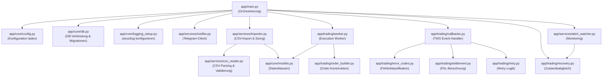

**Wartungs-Hotspots (häufigste Änderungsbereiche):**

| Datei                      | Typische Wartungsarbeiten                                          |
|:---------------------------|:-------------------------------------------------------------------|
| `config.toml`              | Parameter-Tuning (Timeouts, Limits, Intervalle)                    |
| `app/services/csv_reader.py` | Neue CSV-Spalten oder Validierungsregeln hinzufügen              |
| `app/trading/error_codes.py` | Neue TWS-Fehlercodes klassifizieren                              |
| `migrations/`              | Datenbankschema-Erweiterungen                                      |
| `app/services/importer.py` | Änderungen am Sizing-/Downscaling-Algorithmus                     |
| `app/trading/settlement.py`| Änderungen an der PnL-/Slippage-Berechnung                       |

---

## 14. Tests & Qualitätssicherung

### 14.1 Unittests ausführen

```bash
# Alle Tests ausführen
pytest

# Mit Code-Abdeckung (Coverage)
pytest --cov=app --cov-report=term-missing

# Einzelne Testdatei ausführen
pytest tests/test_trading_system.py -v
```

### 14.2 Verfügbare Test-Suites

| Testdatei                      | Beschreibung                                           |
|:-------------------------------|:-------------------------------------------------------|
| `tests/test_trading_system.py` | End-to-End-Tests des gesamten Trading-Flows            |
| `tests/test_directory_watcher.py` | Tests des CSV-Directory-Watchers                    |
| `tests/test_logging.py`       | Tests der Logging-Konfiguration                        |
| `tests/test_order_sync.py`    | Tests des Order-Zustandsabgleichs                      |
| `tests/test_position_check.py`| Tests des Live-Depotabgleichs für Exit-Orders          |
| `tests/test_margin_control.py` | Tests der Margin-Limits (Cushion, What-If) und Warnschwellen |
| `tests/test_heartbeat.py`      | Tests des Keep-Alive Heartbeats und planned/unplanned Gateway-Neustarts |


### 14.3 Code-Style & Linting (Ruff)

```bash
# Linter ausführen
ruff check .

# Automatische Formatierung prüfen
ruff format --check .

# Automatisch formatieren
ruff format .
```

**Ruff-Konfiguration** (aus `pyproject.toml`):
- Zielversion: Python 3.12
- Zeilenlänge: 88 Zeichen
- Anführungszeichen: Doppelt (`""`)
- Aktivierte Regelsätze: E, F, W, I, N, UP, B, A, C4, PL

### 14.4 CI/CD Pipeline

Die Qualitätssicherung läuft automatisiert über GitHub Actions bei jedem Push und Pull Request:

1. **Linting:** `ruff check .`
2. **Formatierung:** `ruff format --check .`
3. **Tests:** `pytest --cov=app`

---

## 15. Glossar

| Begriff              | Bedeutung                                                                |
|:---------------------|:-------------------------------------------------------------------------|
| **EOD**              | End-of-Day — Handelsstrategie, die Orders am Tagesende platziert        |
| **TWS**              | Trader Workstation — Desktop-Plattform von Interactive Brokers           |
| **IB Gateway**       | Headless-Alternative zur TWS für Server-Betrieb                         |
| **Bracket-Order**    | Kombination aus ENTRY + SL + TP als zusammengehörige Einheit            |
| **ENTRY**            | Einstiegsorder (Kauf oder Verkauf zur Positionseröffnung)               |
| **SL (Stop-Loss)**   | Schutzorder zur Verlustbegrenzung                                       |
| **TP (Take-Profit)** | Gewinnmitnahme-Order                                                    |
| **EXIT**             | Allgemeine Ausstiegsorder (z. B. Market-on-Open zum Positionsschluss)   |
| **OCA**              | One-Cancels-All — Wenn SL ausgelöst wird, wird TP automatisch storniert |
| **VWAP**             | Volume-Weighted Average Price — Volumengewichteter Durchschnittspreis   |
| **Slippage**         | Abweichung zwischen geplantem und tatsächlichem Ausführungspreis         |
| **PnL**              | Profit and Loss — Gewinn- und Verlustrechnung                           |
| **WAL**              | Write-Ahead Logging — SQLite-Journalmodus für bessere Parallelität      |
| **SMART Routing**    | Automatische Börsenauswahl durch IBKR für die beste Ausführung          |
| **perm_id**          | Permanente TWS-Order-ID (bleibt über Reconnects hinweg stabil)          |
| **trade_group_id**   | Eindeutiger Bezeichner einer zusammengehörigen Order-Gruppe             |
| **Downscaling**      | Automatische Mengenreduzierung bei unzureichendem Kapital               |
| **Recovery**         | Zustandsabgleich zwischen lokaler DB und TWS nach Systemstart           |
| **Dead Order**       | Order im Status Submitted, die seit > 15 Min. keine Rückmeldung hat    |
| **GTC**              | Good-Till-Cancelled — Order bleibt aktiv bis zur Stornierung            |
| **DAY**              | Tagesorder — verfällt am Ende des Handelstages                          |
| **OPG**              | At-the-Opening — Order wird zur Markteröffnung ausgeführt               |
| **MOC**              | Market-on-Close — Order wird zum Börsenschluss als Marktorder ausgeführt|
| **LMT**              | Limit-Order — wird nur zum angegebenen Preis oder besser ausgeführt     |
| **STP**              | Stop-Order — wird bei Erreichen des Stop-Preises als Marktorder aktiv   |
| **MKT**              | Market-Order — sofortige Ausführung zum aktuellen Marktpreis            |
