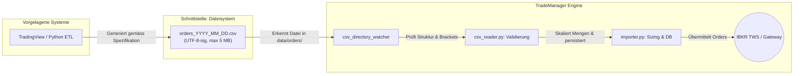

# Schnittstellenvereinbarung: Order-Dateien (CSV Interface Contract)

> **Dokumenten-Version:** 1.0 — Stand: September 2026  
> **Gültigkeit:** TradeManager ab Version 1.1 (Produktivsystem)  
> **Zielgruppe:** Entwickler von Signal-Generatoren (z. B. TradingView-Pipelines, ETL-Skripte), System-Integratoren und Betreiber.

---

## 1. Zweck & Systemkontext

Diese Spezifikation definiert die verbindliche Schnittstelle zwischen vorgelagerten Signal-Generatoren (z. B. TradingView-Strategien, Python-Analyseskripte) und dem **TradeManager**.

Der TradeManager liest börsentäglich eine strukturierte CSV-Datei ein, führt Plausibilitäts- und Bracket-Validierungen durch, skaliert Positionsgrößen dynamisch anhand des verfügbaren Kontokapitals (Downscaling) und übermittelt die resultierenden Order-Gruppen an Interactive Brokers (TWS / IB Gateway).



---

## 2. Dateikonventionen & Transport

| Eigenschaft | Vorgabe / Spezifikation |
| :--- | :--- |
| **Dateinamensmuster** | `orders_YYYY_MM_DD.csv` (z. B. `orders_2026_09_05.csv`). Dateiname muss dem aktuellen Handelsdatum entsprechen. |
| **Zielverzeichnis** | `data/orders/` im TradeManager-Wurzelverzeichnis (wird durch Hintergrunddienst überwacht). |
| **Zeichensatz (Encoding)** | `UTF-8` oder `UTF-8 mit BOM` (`utf-8-sig`). Der Importer unterstützt beide Formate transparent. |
| **Spaltentrennzeichen** | Komma (`,`). |
| **Zeilentrennzeichen** | LF (`\n`, Unix) oder CRLF (`\r\n`, Windows). |
| **Kopfzeile (Header)** | **Zwingend erforderlich** in Zeile 1. Groß-/Kleinschreibung wird toleriert; führende/nachfolgende Leerzeichen werden gestrippt. |
| **Reihenfolge der Spalten** | Beliebig (das Parsing erfolgt namensbasiert via Spalten-Header). |
| **Maximale Dateigröße** | **5 MB** (Dateien > 5 MB werden aus Sicherheitsgründen abgewiesen). |

---

## 3. Spaltenspezifikation (Vollständige Referenz)

Jede Zeile in der CSV-Datei repräsentiert ein einzelnes **Order-Leg**. Die Datei muss exakt die folgenden **12 Spalten** enthalten:

| Spalte | Datentyp | Pflicht | Erlaubte Werte | Beschreibung & Validierungsregeln |
| :--- | :--- | :---: | :--- | :--- |
| `trade_group_id` | Text | **Ja** | String (1–64 Zeichen) | Eindeutige Gruppen-ID, die ENTRY-Order mit den zugehörigen SL-, TP- oder EXIT-Legs verbindet. Keine Leerzeichen. Beispiel: `20260905_Momentum_AAPL_01`. |
| `bracket_role` | Enum | **Ja** | `ENTRY`, `SL`, `TP`, `EXIT` | Rolle der Order innerhalb der Trade-Gruppe. Case-insensitive (wird intern in Großbuchstaben konvertiert). |
| `symbol` | Text | **Ja** | Tickersymbol (z. B. `AAPL`, `MSFT`, `QQQ`) | Basiswert der Order. Muss für **alle Legs derselben `trade_group_id` identisch** sein. |
| `sec_type` | Text | **Ja** | `STK` | Wertpapierklasse. In der CSV **immer `STK`** eintragen (auch bei Strategien mit automatischer Futures-Wandlung wie BounceBandit). |
| `exchange` | Text | **Ja** | `SMART` | Routing-Börsenplatz. In der CSV **immer `SMART`** eintragen. |
| `account_id` | Text | **Ja** | IBKR-Kontonummer (z. B. `U19605236`) | Ziel-Handelskonto. Muss für **alle Legs derselben `trade_group_id` identisch** sein. |
| `action` | Enum | **Ja** | `BUY`, `SELL` | Handelsrichtung. |
| `quantity` | Ganzzahl | **Ja** | Integer > 0 | Soll-Stückzahl. Bei Kapitalengpässen skaliert der TradeManager diese Menge symmetrisch herunter. |
| `order_type` | Enum | **Ja** | `LMT`, `STP`, `MKT`, `MOC` | Ausführungstyp für die TWS (Limit, Stop, Market, Market-on-Close). |
| `target_price` | Dezimal | **Bedingt** | Zahl mit Punkt (z. B. `185.50`) | **Pflicht** bei `LMT` und `STP` (> 0.00). Bei `MKT` und `MOC` leer lassen oder `0.00` eintragen. |
| `tif` | Enum | Nein | `GTC`, `DAY`, `OPG` | Time-In-Force. Standardwert ist `GTC`, falls leer gelassen. |
| `strategy_name` | Text | Nein | String (z. B. `Momentum`, `DipBuyer`, `BounceBandit`) | Name der Signal-Strategie. Steuert strategie-spezifische Transformationsregeln im TradeManager. |

---

## 4. Validierungsregeln für Trade-Gruppen (`validate_group`)

Eine CSV-Datei wird vor der Ausführung vollständig validiert. Schlägt die Validierung einer Gruppe fehl, wird der Import abgewiesen und eine Fehlermeldung protokolliert.

### 4.1 Gruppen-Integrität
1. **Maximal eine ENTRY-Order:** Eine `trade_group_id` darf höchstens eine Order mit `bracket_role = 'ENTRY'` enthalten.
2. **Konsistenz von Symbol & Konto:** Alle Zeilen mit derselben `trade_group_id` müssen zwingend denselben Wert in `symbol` und `account_id` aufweisen.
3. **Gegenrichtung für Exits:**
   - Ist der ENTRY ein Kauf (`action = 'BUY'`), müssen alle SL-, TP- und EXIT-Legs `action = 'SELL'` sein.
   - Ist der ENTRY ein Leerverkauf (`action = 'SELL'`), müssen alle SL-, TP- und EXIT-Legs `action = 'BUY'` sein.
4. **Preispflicht:** Für `order_type = 'LMT'` und `order_type = 'STP'` muss `target_price` positiv sein (`> 0.00`). Kommazahlen müssen mit Punkt notiert werden (z. B. `123.45`, nicht `123,45`).
5. **Positive Stückzahl:** `quantity` muss eine positive ganze Zahl (`>= 1`) sein.

### 4.2 Reiner Exit (ohne ENTRY in der Datei)
Enthält eine Gruppe keinen `ENTRY`, sondern nur Exit-Legs (`SL`, `TP` oder `EXIT`), gilt dies als **Positionsschließung**:
- Der zugehörige Trade muss bereits mit derselben `trade_group_id` und `account_id` in der lokalen Datenbank existieren.
- Ausnahmeregelung für `DipBuyer`: Montags und dienstags werden DipBuyer-Exits auch dann akzeptiert, wenn noch kein ENTRY in der lokalen DB vorliegt (Wochenend-Holdings).

### 4.3 Multi-Exit-Unterstützung
Seit Migration `002` können pro Gruppe **mehrere Exit-Orders** definiert werden (Composite Key `account_id, trade_group_id, bracket_role, order_type`):
- Beispiel: Ein Take-Profit als Limit (`TP` mit `LMT`) kombiniert mit einer zeitbasierten Schließung zum Börsenschluss (`EXIT` mit `MOC`).

---

## 5. Strategie-Sonderregeln für Signal-Generatoren

### 5.1 BounceBandit (Automatische QQQ ➔ MNQ Future Transformation)
Für die Futures-Strategie `BounceBandit` generiert der externe Signal-Generator Standard-Aktien-Einträge auf den ETF `QQQ`. Die Konvertierung in den CME-Future übernimmt der TradeManager:

* **Eingabe im Signal-Generator (CSV):**
  - `symbol`: `QQQ`
  - `sec_type`: `STK`
  - `exchange`: `SMART`
  - `strategy_name`: `BounceBandit`
* **Automatische Transformation im TradeManager:**
  - Erkennt `strategy_name = 'BounceBandit'` und `symbol = 'QQQ'`.
  - Fragt über `future_resolver.py` an der CME (`exchange = 'CME'`) den aktuell aktivsten Quartalskontrakt für den **Micro E-mini Nasdaq-100 Future (`MNQ`)** ab (Front-Month mit höchstem Volumen, z. B. `MNQU6`).
  - Passt `sec_type = 'FUT'`, `exchange = 'CME'`, `symbol = <Kontraktsymbol>` und `quantity = 1` automatisch an.

---

## 6. Verarbeitungs- & Archivierungs-Lifecycle

```text
[Signal-Generator] ──> data/orders/orders_YYYY_MM_DD.csv
                             │
                             ▼
                      [TradeManager Importer]
                             │
            ┌────────────────┴────────────────┐
            ▼                                 ▼
      Alle Orders OK?                  Fehler / Abbruch?
            │                                 │
            ▼                                 ▼
data/orders/archive/              data/orders/archive/
orders_YYYY_MM_DD.csv.bak         orders_YYYY_MM_DD.csv.err
(+ Telegram Info)                 (+ Telegram 🚨 Alarm)
```

1. **Ablage:** Externe Generatoren legen die Datei als `data/orders/orders_YYYY_MM_DD.csv` ab.
2. **Import & Queue:** Der `csv_directory_watcher` erkennt die Datei, liest sie ein, berechnet das Sizing, speichert die Orders im Zustand `Created` und reiht sie in die asynchrone Queue ein.
3. **Archivierung bei Erfolg (.bak):** Wurden alle Order-Gruppen fehlerfrei an TWS übermittelt, wird die Datei umbenannt nach `data/orders/archive/orders_YYYY_MM_DD.csv.bak`.
4. **Archivierung bei Fehler (.err):** Tritt ein Validierungsfehler auf oder wird eine Order storniert/abgelehnt, wird die Datei nach `data/orders/archive/orders_YYYY_MM_DD.csv.err` verschoben und sofort ein Administrator-Alarm über Telegram versendet.

---

## 7. Typische CSV-Beispiele

### 7.1 Vollständiges Bracket (ENTRY + Stop-Loss + Take-Profit)
```csv
trade_group_id,bracket_role,symbol,sec_type,exchange,account_id,action,quantity,order_type,target_price,tif,strategy_name
20260905_Momentum_001,ENTRY,NVDA,STK,SMART,U19605236,BUY,10,LMT,208.50,DAY,Momentum
20260905_Momentum_001,SL,NVDA,STK,SMART,U19605236,SELL,10,STP,195.00,GTC,Momentum
20260905_Momentum_001,TP,NVDA,STK,SMART,U19605236,SELL,10,LMT,225.00,GTC,Momentum
```

### 7.2 Reiner Einstieg (ENTRY ohne Schutzorders)
```csv
trade_group_id,bracket_role,symbol,sec_type,exchange,account_id,action,quantity,order_type,target_price,tif,strategy_name
20260905_Turnover_001,ENTRY,MU,STK,SMART,U19605236,BUY,5,LMT,938.82,DAY,TurnoverTiming
```

### 7.3 Reiner Ausstieg (Position schließen via Market-on-Open)
```csv
trade_group_id,bracket_role,symbol,sec_type,exchange,account_id,action,quantity,order_type,target_price,tif,strategy_name
20260905_Exit_001,EXIT,TSLA,STK,SMART,U19605236,SELL,10,MKT,0.00,OPG,Momentum
```

### 7.4 BounceBandit Einstieg (wird zu MNQ-Future konvertiert)
```csv
trade_group_id,bracket_role,symbol,sec_type,exchange,account_id,action,quantity,order_type,target_price,tif,strategy_name
20260905_Bounce_001,ENTRY,QQQ,STK,SMART,U19605236,BUY,1,MKT,0.00,DAY,BounceBandit
```

---

## 8. Python-Codebeispiel für Signal-Generatoren

Das folgende Skript demonstriert, wie Signale in Python regelkonform exportiert werden:

```python
"""Beispiel-Generator für TradeManager-kompatible CSV-Order-Dateien."""

from datetime import date
from decimal import Decimal
import pandas as pd

today_str = date.today().strftime("%Y_%m_%d")
output_path = f"data/orders/orders_{today_str}.csv"

orders = [
    {
        "trade_group_id": f"{today_str}_Momentum_AAPL_01",
        "bracket_role": "ENTRY",
        "symbol": "AAPL",
        "sec_type": "STK",
        "exchange": "SMART",
        "account_id": "U19605236",
        "action": "BUY",
        "quantity": 15,
        "order_type": "LMT",
        "target_price": Decimal("224.50"),
        "tif": "DAY",
        "strategy_name": "Momentum",
    },
    {
        "trade_group_id": f"{today_str}_Momentum_AAPL_01",
        "bracket_role": "SL",
        "symbol": "AAPL",
        "sec_type": "STK",
        "exchange": "SMART",
        "account_id": "U19605236",
        "action": "SELL",
        "quantity": 15,
        "order_type": "STP",
        "target_price": Decimal("215.00"),
        "tif": "GTC",
        "strategy_name": "Momentum",
    },
    {
        "trade_group_id": f"{today_str}_Momentum_AAPL_01",
        "bracket_role": "TP",
        "symbol": "AAPL",
        "sec_type": "STK",
        "exchange": "SMART",
        "account_id": "U19605236",
        "action": "SELL",
        "quantity": 15,
        "order_type": "LMT",
        "target_price": Decimal("240.00"),
        "tif": "GTC",
        "strategy_name": "Momentum",
    },
]

dataframe = pd.DataFrame(orders)

# Dezimalpreise formatieren: None/NaN -> leerer String, Zahlen mit 2 Nachkommastellen
dataframe["target_price"] = dataframe["target_price"].apply(
    lambda p: f"{p:.2f}" if pd.notnull(p) and p != "" else ""
)

# Export mit UTF-8-sig (BOM)
dataframe.to_csv(output_path, index=False, encoding="utf-8-sig")
print(f"Order-Datei erfolgreich exportiert: {output_path}")
```

---

## 9. Checkliste vor dem Export

Vor dem Abspeichern der CSV-Datei in `data/orders/` sicherstellen:
* [ ] Dateiname folgt dem Muster `orders_YYYY_MM_DD.csv` mit dem aktuellen Datum.
* [ ] UTF-8-Kodierung ist gesetzt (idealerweise `utf-8-sig`).
* [ ] Alle 12 Pflichtspalten sind vorhanden.
* [ ] `target_price` verwendet den Punkt (`.`) als Dezimaltrenner.
* [ ] Bei `LMT` und `STP` ist ein positiver Zielpreis angegeben.
* [ ] Alle Legs einer Gruppe besitzen identische `symbol`- und `account_id`-Werte.
* [ ] Exit-Legs (`SL`, `TP`, `EXIT`) haben die Gegenrichtung zur `ENTRY`-Aktion.
* [ ] Dateigröße liegt unter 5 MB.
